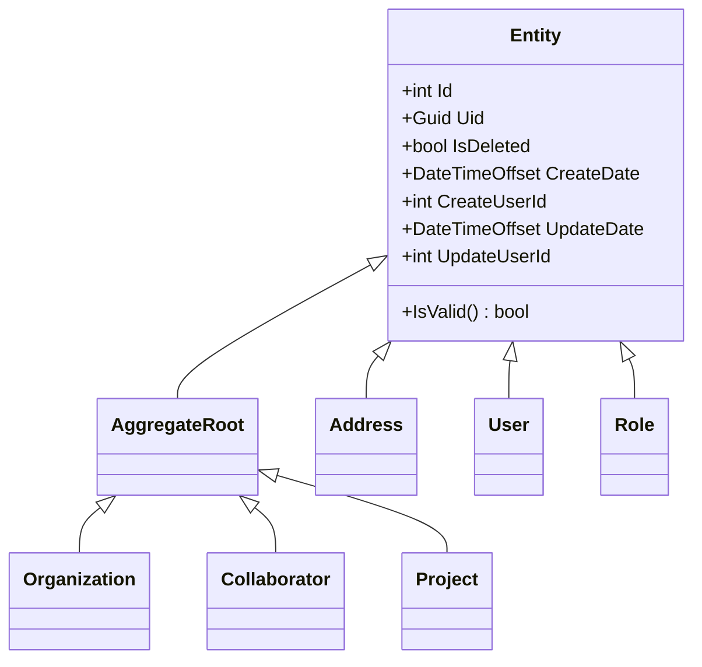
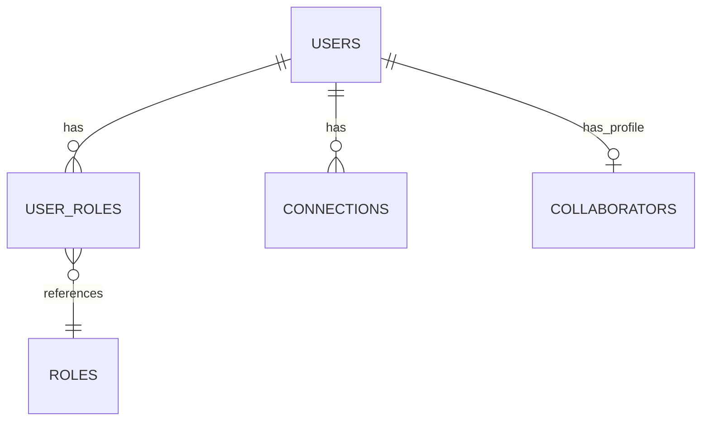
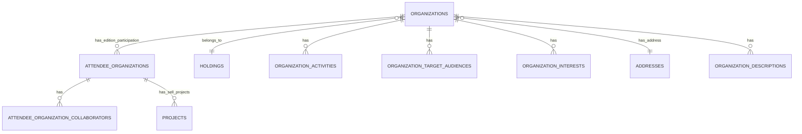
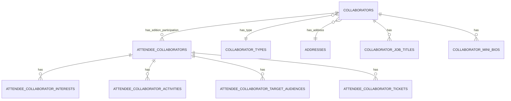
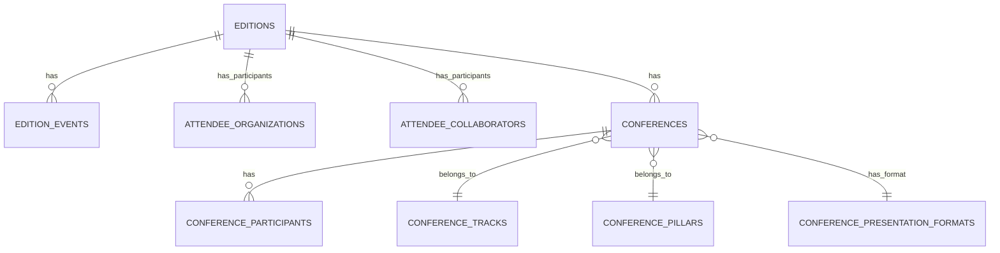

# PlataformaRio2C Database Structure Documentation

## 1. Database Schema Overview

The PlataformaRio2C platform uses Microsoft SQL Server with Entity Framework 6.x in a code-first approach. The database schema follows a domain-driven design that models the complex business requirements of the Rio2C event management platform.

The database structure is organized into several interconnected domains, each representing a key aspect of the event management platform, such as user management, organization management, collaborator management, and various domain-specific entities for audiovisual, music, innovation, and cartoon projects.

### Core Entity Structure

All entities in the system inherit from a base `Entity` class that provides common fields:



## 2. Main Tables and Their Relationships

### User Management Domain



**Tables:**
- **Users**: Core user accounts
  - Primary Key: Id (int)
  - Unique: Uid (Guid), Email (varchar)
  - Notable Fields: Email, Password, FirstName, LastName, IsEmailConfirmed, IsDeleted
  - Relationships: One-to-many with User_Roles, One-to-one with Collaborators

- **Roles**: Defines user roles for authorization
  - Primary Key: Id (int)
  - Unique: Uid (Guid), Name (varchar)
  - Notable Fields: Name, Description
  - Relationships: Many-to-many with Users via User_Roles

- **User_Roles**: Junction table for the many-to-many relationship between Users and Roles
  - Primary Key: Id (int)
  - Foreign Keys: UserId, RoleId
  - Relationships: Many-to-one with Users and Roles

- **Connections**: Stores connection information for real-time communication
  - Primary Key: Id (int)
  - Foreign Key: UserId
  - Notable Fields: ConnectionId, Connected, LastActivity
  - Relationships: Many-to-one with Users

### Organization Management Domain



**Tables:**
- **Organizations**: Core entity for companies and institutions
  - Primary Key: Id (int)
  - Unique: Uid (Guid)
  - Foreign Keys: HoldingId, AddressId
  - Notable Fields: Name, CompanyName, TradeName, Website, Social media links
  - Relationships: Belongs to a Holding, Has many AttendeeOrganizations

- **Holdings**: Parent companies or groups that own multiple organizations
  - Primary Key: Id (int)
  - Unique: Uid (Guid)
  - Notable Fields: Name
  - Relationships: Has many Organizations

- **AttendeeOrganizations**: Organizations participating in specific editions
  - Primary Key: Id (int)
  - Unique: Uid (Guid)
  - Foreign Keys: OrganizationId, EditionId
  - Relationships: Many-to-one with Organizations, Many-to-one with Editions

- **OrganizationActivities**: Activities relevant to organizations
  - Primary Key: Id (int)
  - Foreign Keys: OrganizationId, ActivityId
  - Relationships: Many-to-one with Organizations, Many-to-one with Activities

- **OrganizationTargetAudiences**: Target audiences for organizations
  - Primary Key: Id (int)
  - Foreign Keys: OrganizationId, TargetAudienceId
  - Relationships: Many-to-one with Organizations, Many-to-one with TargetAudiences

### Collaborator Management Domain



**Tables:**
- **Collaborators**: Core entity for people participating in various capacities
  - Primary Key: Id (int)
  - Unique: Uid (Guid)
  - Foreign Keys: CollaboratorTypeId, AddressId, UserId
  - Notable Fields: FirstName, LastName, Email, JobTitle, CompanyName
  - Relationships: One-to-one with Users, Has many AttendeeCollaborators

- **CollaboratorTypes**: Types of collaborators
  - Primary Key: Id (int)
  - Unique: Uid (Guid)
  - Notable Fields: Name, Description
  - Relationships: Has many Collaborators

- **AttendeeCollaborators**: Collaborators attending specific editions
  - Primary Key: Id (int)
  - Unique: Uid (Guid)
  - Foreign Keys: CollaboratorId, EditionId
  - Relationships: Many-to-one with Collaborators, Many-to-one with Editions

- **CollaboratorJobTitles**: Job titles for collaborators
  - Primary Key: Id (int)
  - Foreign Keys: CollaboratorId, LanguageId
  - Notable Fields: Title
  - Relationships: Many-to-one with Collaborators, Many-to-one with Languages

### Project Management Domain

```mermaid
erDiagram
    PROJECTS ||--o{ PROJECT_TITLES : has
    PROJECTS ||--o{ PROJECT_LOG_LINES : has
    PROJECTS ||--o{ PROJECT_SUMMARIES : has
    PROJECTS ||--o{ PROJECT_PRODUCTION_PLANS : has
    PROJECTS ||--o{ PROJECT_ADDITIONAL_INFORMATIONS : has
    PROJECTS ||--o{ PROJECT_INTERESTS : has
    PROJECTS ||--o{ PROJECT_TARGET_AUDIENCES : has
    PROJECTS ||--o{ PROJECT_IMAGE_LINKS : has
    PROJECTS ||--o{ PROJECT_TEASER_LINKS : has
    PROJECTS ||--o{ PROJECT_BUYER_EVALUATIONS : has
    PROJECTS ||--o{ COMMISSION_EVALUATIONS : has
    PROJECTS }o--|| PROJECT_TYPES : has_type
    PROJECTS }o--|| PROJECT_MODALITIES : has_modality
    PROJECTS }o--|| ATTENDEE_ORGANIZATIONS : has_seller
```



**Tables:**
- **Projects**: Core entity for audiovisual projects
  - Primary Key: Id (int)
  - Unique: Uid (Guid)
  - Foreign Keys: ProjectTypeId, ProjectModalityId, SellerAttendeeOrganizationId
  - Notable Fields: TotalPlayingTime, EachEpisodePlayingTime, ValueInformation
  - Relationships: Has many translations (titles, summaries, etc.), Has many evaluations

- **ProjectTypes**: Types of projects (e.g., feature film, series, documentary)
  - Primary Key: Id (int)
  - Unique: Uid (Guid)
  - Notable Fields: Name
  - Relationships: Has many Projects

- **ProjectTitles**: Multilingual titles for projects
  - Primary Key: Id (int)
  - Foreign Keys: ProjectId, LanguageId
  - Notable Fields: Title
  - Relationships: Many-to-one with Projects, Many-to-one with Languages

- **ProjectBuyerEvaluations**: Evaluations submitted by buyers
  - Primary Key: Id (int)
  - Foreign Keys: ProjectId, BuyerUserId
  - Notable Fields: EvaluationStatus, Comments
  - Relationships: Many-to-one with Projects

- **CommissionEvaluations**: Evaluations submitted by commission members
  - Primary Key: Id (int)
  - Foreign Keys: ProjectId, EvaluatorUserId
  - Notable Fields: Rating, Comments
  - Relationships: Many-to-one with Projects

### Event Management Domain



**Tables:**
- **Editions**: Different editions of the Rio2C event
  - Primary Key: Id (int)
  - Unique: Uid (Guid) 
  - Notable Fields: Name, StartDate, EndDate, IsActive
  - Relationships: Has many EditionEvents, AttendeeOrganizations, AttendeeCollaborators

- **EditionEvents**: Events within an edition
  - Primary Key: Id (int)
  - Foreign Key: EditionId
  - Notable Fields: Name, StartDateTime, EndDateTime
  - Relationships: Many-to-one with Editions

- **Conferences**: Conference sessions
  - Primary Key: Id (int)
  - Foreign Keys: EditionId, TrackId, PillarId, PresentationFormatId
  - Notable Fields: StartDateTime, EndDateTime, IsApiDisplayEnabled
  - Relationships: Has many ConferenceParticipants, Belongs to Track, Pillar, PresentationFormat

### Specialized Domains

The database also includes specialized domains for Music, Innovation, and Cartoon/Creator with their own set of tables:

**Music Domain**:
- MusicBands
- MusicProjects
- MusicGenres
- MusicBandEvaluations
- MusicBusinessRoundProjects
- MusicBusinessRoundNegotiations

**Innovation Domain**:
- InnovationOrganizations
- AttendeeInnovationOrganizations
- InnovationOrganizationTracks
- InnovationOrganizationEvaluations

**Cartoon/Creator Domain**:
- CartoonProjects
- CartoonProjectFormats
- AttendeeCartoonProjects
- CartoonProjectEvaluations
- CreatorProjects
- AttendeeCreatorProjects

### Common and Support Domains

**Addresses Domain**:
- Addresses
- Countries
- States
- Cities

**Localization Domain**:
- Languages

**Categorization Domain**:
- Activities
- TargetAudiences
- InterestGroups
- Interests

**Logistics Domain**:
- LogisticAccommodations
- LogisticAirfares
- LogisticTransfers
- Places

## 3. Important Indexes and Their Purpose

The database uses several types of indexes to optimize query performance:

1. **Primary Key Indexes**: Each table has a clustered index on its primary key (Id field).

2. **Foreign Key Indexes**: Most foreign key columns are indexed to improve join performance.

3. **Unique Indexes**: Several columns with unique constraints have unique indexes:
   - Users.Email
   - Users.Uid
   - Roles.Name
   - Organizations.Uid
   - Collaborators.Uid

4. **Common Query Indexes**: Columns frequently used in WHERE clauses are indexed:
   - IsDeleted flag (used for soft deletes)
   - EditionId (for filtering by current edition)
   - Creation and update timestamps for sorting by most recent

## 4. Stored Procedures, Functions, and Triggers

The application primarily uses Entity Framework for data access, and directly embedded SQL for migrations, rather than stored procedures or triggers. The database does not appear to have custom stored procedures, functions, or triggers as the business logic is primarily implemented at the application level.

## 5. Data Models and Main Entities

### Core Business Entities

The database schema is organized around these primary business entities:

1. **Edition**: Represents a specific instance of the Rio2C event, with dates, configuration, and related events.

2. **Organization**: Represents companies participating in the event in various capacities (sellers, buyers, sponsors).

3. **Collaborator**: Represents individuals participating in the event in various roles.

4. **Project**: Represents audiovisual content (films, series, etc.) submitted for negotiations or pitching.

5. **Conference**: Represents scheduled sessions or panels within the event.

6. **MusicBand/MusicProject**: Represents music artists and their projects participating in the event.

7. **InnovationOrganization**: Represents startups and tech companies participating in the innovation track.

8. **CartoonProject/CreatorProject**: Represents animation and creator content submitted to the event.

### Entity Inheritance Pattern

The system uses a simple inheritance pattern with base classes:

- **Entity**: Base class for all entities, providing common fields like Id, Uid, and auditing fields.
- **AggregateRoot**: Inherits from Entity and serves as a marker for domain aggregates.

### Domain Associations

The system models many types of relationships:

1. **One-to-Many**: E.g., Organization to AttendeeOrganizations, Project to ProjectTitles.
2. **Many-to-Many**: E.g., Organizations to Activities (via OrganizationActivities junction table).
3. **One-to-One**: E.g., User to Collaborator.

## 6. Migration and Versioning Strategy

The PlataformaRio2C system uses Entity Framework Code First Migrations with a custom SQL script-based approach:

### Migration Implementation

1. **Custom SqlMigration Base Class**: The system uses a custom `SqlMigration` class that inherits from Entity Framework's `DbMigration`. This class is designed to:
   - Look for SQL script files in a specific naming pattern
   - Execute these scripts directly rather than using Entity Framework's automatic migration generation
   - Support environment-specific migrations (test, prod, etc.)

2. **SQL Script Files**: Each migration has corresponding `.up.sql` and `.down.sql` files containing raw SQL commands to:
   - Create or alter tables
   - Add, modify, or remove columns
   - Create indexes
   - Insert or update seed data

3. **Environment-Specific Migrations**: Migrations can be annotated with `[EnvironmentVariable]` to specify in which environments (dev, test, prod) they should run.

### Migration Workflow

1. **Creation**: Migrations are created using the Entity Framework commands:
   ```
   Add-Migration [MigrationName] -Project PlataformaRio2C.Infra.Data.Context -StartupProject PlataformaRio2C.Web.Admin
   ```

2. **SQL Scripts**: After the migration shell is created, developers write the actual SQL scripts for both up and down migrations.

3. **Execution**: Migrations are automatically applied in test and production environments but must be manually triggered in development.

4. **Versioning**: Migrations follow a timestamp-based naming convention:
   - Format: `yyyyMMddHHmmss_MigrationName`
   - Example: `202408202223049_Initial.cs`

## 7. Database-Related Design Decisions and Justifications

### 1. Soft Delete Pattern

**Decision**: Use soft deletes (IsDeleted flag) instead of physically removing records.

**Justification**:
- Preserves historical data and relationships
- Allows for data recovery
- Maintains referential integrity while "hiding" deleted records
- Enables audit trails for deleted records

### 2. Code-First with SQL Scripts

**Decision**: Use Entity Framework Code-First with direct SQL scripts for migrations.

**Justification**:
- Provides precise control over database schema changes
- Allows for complex operations not easily expressed in Code-First
- Enables environment-specific migrations
- Makes database changes more explicit and reviewable

### 3. Internationalization via Entity Translations

**Decision**: Store multilingual content in separate translation tables.

**Justification**:
- Supports multiple languages without schema changes
- More efficient than storing all translations in a single entity
- Allows for language-specific querying
- Enables adding new languages without modifying existing entities

### 4. GUID-Based External Identifiers

**Decision**: Use GUIDs (Uid property) for external identification while keeping integer IDs for internal references.

**Justification**:
- Prevents exposing sequential IDs in public APIs
- Makes IDs non-guessable for security
- Allows for easier merging of data from different sources
- Enables client-side ID generation when needed

### 5. Edition-Based Data Partitioning

**Decision**: Associate most business entities with specific event editions.

**Justification**:
- Naturally partitions data by event
- Improves query performance by filtering by current edition
- Enables edition-specific configuration and rules
- Facilitates historical data archiving

## 8. Performance Optimizations

The database implements several performance optimizations:

### 1. Query Optimizations

- **Indexing Strategy**: Foreign keys and commonly queried fields are indexed
- **Soft Delete Filtering**: `IsDeleted = 0` condition added to most queries
- **Edition-Based Filtering**: Most queries filter by the current edition
- **Projection Queries**: Many queries use projection to select only needed columns

### 2. Command Timeout Configuration

The database command timeout is set to 180 seconds to accommodate longer-running operations:

```csharp
((IObjectContextAdapter)this).ObjectContext.CommandTimeout = 180;
```

### 3. Bulk Operations Support

The system uses the Z.EntityFramework.Extensions library for improved performance in bulk insert, update, and delete operations:

```xml
<package id="Z.EntityFramework.Extensions" version="5.1.35.0" />
```

### 4. Lazy Loading Control

Entity Framework's lazy loading is controlled to prevent N+1 query issues:

- Explicit loading of related entities when needed
- Strategic use of Include() to pre-load required related entities

### 5. Connection Management

The application uses connection pooling and maintains connections appropriately to minimize connection overhead.

## Conclusion

The PlataformaRio2C database is designed to support a complex event management platform with multiple interconnected domains. The schema follows domain-driven design principles, with entities organized around business concepts and a clean separation of concerns. The migration strategy provides precise control over schema evolution while supporting different environments.

The database is optimized for the specific access patterns of the application, with appropriate indexing and performance tuning. The design decisions, such as soft deletes and edition-based partitioning, reflect the business requirements of maintaining historical data while providing efficient access to current event information.