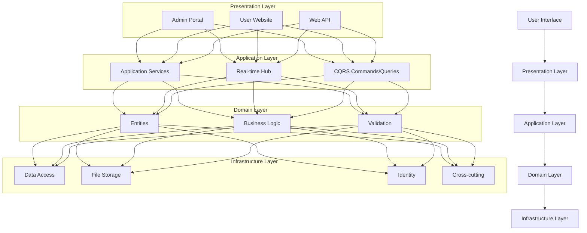

# PlataformaRio2C (MyRio2C)

[](https://dotnet.microsoft.com/download/dotnet-framework/4.8)
[](https://www.nuget.org/packages/EntityFramework/6.4.0)
[](https://www.microsoft.com/en-us/sql-server/sql-server-2022)

## 1. Project Description and Purpose

PlataformaRio2C (MyRio2C) is a comprehensive management platform for Rio2C, a major creative industry event that brings together professionals from various sectors including Audiovisual, Music, Innovation, and Cartoon/Creator content. The platform serves as a central hub for event management, participant registration, project submissions, business matchmaking, and networking facilitation.

The system enables event organizers to manage different types of event areas, while allowing participants to register, submit projects, schedule meetings, and interact with other attendees across different creative sectors. The platform supports multiple languages and provides specialized functionality for each creative area.

## 2. Key Features and Functionality

### Core Functionality

- **Multi-sector Event Management**: Specialized modules for Audiovisual, Music, Innovation, and Cartoon/Creator areas
- **User Management**: Different user roles (Admin, AdminPartial, User) with appropriate permissions
- **Project Submissions and Evaluations**: Support for different project types with specialized evaluation workflows
- **Business Matchmaking**: Automated and manual negotiation scheduling between participants
- **Multilingual Support**: Built-in internationalization with resources for multiple languages
- **Organization and Collaborator Management**: Company, holding, and collaborator registration and management
- **Conference and Event Management**: Management of conference sessions, speakers, tracks, and rooms
- **File Management**: Document and image handling with AWS S3 integration

### Sector-Specific Features

#### Audiovisual Sector
- Project submission and evaluation by commission members
- Business round meeting scheduling between producers and buyers
- Pitching project management

#### Music Sector
- Music band/artist registration and management
- Music business round project submission and evaluation
- Scheduling of meetings between music industry professionals

#### Innovation Sector
- Startup and innovation organization management
- Track-based organization and categorization
- Innovation commission evaluations

#### Cartoon/Creator Sector
- Cartoon project submission and evaluation
- Creator project management

### System Architecture



## 3. Technology Stack

### Core Framework and Languages
- **Platform**: ASP.NET MVC (.NET Framework 4.8)
- **Languages**: C#, JavaScript, HTML, CSS
- **Database**: Microsoft SQL Server 2022
- **ORM**: Entity Framework 6.4.0 with Z.EntityFramework.Extensions for bulk operations

### Architecture Patterns
- **Architecture**: Domain-Driven Design (DDD)
- **Pattern**: Command Query Responsibility Segregation (CQRS)
- **Dependency Injection**: SimpleInjector 4.6.0

### Key Libraries and Components
- **API Framework**: ASP.NET Web API 5.2.7
- **Authentication**: Custom Identity Management with Microsoft.AspNet.Identity.Core 2.2.2
- **Real-time Communication**: SignalR (for Hub functionality)
- **Document Generation**: 
  - iTextSharp 5.5.13.2 for PDF generation
  - ClosedXML 0.94.2 for Excel operations
  - EPPlus 4.5.3.2 for Excel report generation
- **File Storage**: AWS S3 (with local storage fallback option)
- **JSON Handling**: Newtonsoft.Json 13.0.1
- **Logging**: log4net 2.0.12
- **Error Tracking**: ELMAH
- **Pagination**: X.PagedList 7.9.0
- **Validation**: Foolproof 0.9.4518, jQuery Validation

### Development Tools
- **IDE**: Visual Studio 2022
- **Source Control**: Git
- **Container Support**: Docker (SQL Server container available)

## 4. Setup Instructions

### Prerequisites
- Visual Studio 2019/2022 with .NET Framework 4.8 SDK
- SQL Server 2022 (or Docker with SQL Server container)
- Git for source control

### Development Environment Setup

#### Database Setup
1. **Using Docker (Recommended)**:
   ```bash
   docker-compose up
   ```
   This will start a SQL Server 2022 container with the following credentials:
   - Server: localhost,1433
   - User: sa
   - Password: SqlServer2022!

2. **Using Local SQL Server**:
   - Create a new database named `MyRio2C_Dev`
   - Update the connection string in Web.config files if needed

#### Application Setup
1. **Clone the repository**:
   ```bash
   git clone [repository URL]
   cd Rio2C-MyRio2C
   ```

2. **Build the solution** to download NuGet packages:
   ```
   # Using Visual Studio: Ctrl + Shift + B or right-click on solution > Build Solution
   # Using .NET CLI: dotnet build PlataformaRio2C.sln
   ```
   Note: Multiple builds might be necessary to download all NuGet packages.

3. **Run database migrations**:
   ```
   # In Visual Studio Package Manager Console:
   Update-Database -Project PlataformaRio2C.Infra.Data.Context
   ```

4. **Configure AWS credentials** (if using AWS S3 for file storage):
   - Update AWS credentials in the Web.config files
   - Alternatively, set `FileHost` to `local` in Web.config to use local file storage

5. **Run the application**:
   - Set PlataformaRio2C.Web.Admin or PlataformaRio2C.Web.Site as the startup project
   - Press F5 or click Start in Visual Studio

### Annual Maintenance Requirements
- Update the Z.EntityFramework.Extensions library at least once per year:
  ```
  # Using NuGet Package Manager Console:
  Update-Package Z.EntityFramework.Extensions
  
  # Using shell:
  nuget update Z.EntityFramework.Extensions
  ```

## 5. Repository Structure

```
PlataformaRio2C/
├── source/                           # Main source code directory
│   ├── Presentation/                 # User interface layer (0)
│   │   └── Web/                      # Web applications
│   │       ├── PlataformaRio2C.Web.Admin/  # Admin portal
│   │       └── PlataformaRio2C.Web.Site/   # User-facing website
│   │
│   ├── Services/                     # Service layer (1)
│   │   └── PlataformaRio2C.WebApi/   # API services
│   │
│   ├── Application/                  # Application layer (2)
│   │   ├── PlataformaRio2C.Application/     # Application services
│   │   └── PlataformaRio2C.HubApplication/  # Real-time communication
│   │
│   ├── Domain/                       # Domain layer (3)
│   │   └── PlataformaRio2C.Domain/   # Business entities and rules
│   │
│   └── Infra/                        # Infrastructure layer (4)
│       ├── Data/                     # Data access (4.1)
│       │   ├── PlataformaRio2C.Infra.Data.Context/     # Database context
│       │   ├── PlataformaRio2C.Infra.Data.Repository/  # Repositories
│       │   └── PlataformaRio2c.Infra.Data.FileRepository/  # File storage
│       │
│       ├── CrossCutting/             # Cross-cutting concerns (4.2)
│       │   ├── PlataformaRio2C.Infra.CrossCutting.Identity/     # Authentication
│       │   ├── PlataformaRio2C.Infra.CrossCutting.IOC/          # Dependency injection
│       │   ├── PlataformaRio2C.Infra.CrossCutting.Resources/    # Localization resources
│       │   ├── PlataformaRio2C.Infra.CrossCutting.Tools/        # Utility tools
│       │   ├── PlataformaRio2C.Infra.CrossCutting.CQRS/         # CQRS implementation
│       │   ├── PlataformaRio2C.Infra.CrossCutting.SalesPlatforms/  # Sales platform integration
│       │   ├── PlataformaRio2C.Infra.CrossCutting.SocialMediaPlatforms/  # Social media integration
│       │   └── PlataformaRio2C.Infra.CrossCutting.SystemParameter/  # System parameters
│       │
│       └── Report/                   # Reporting services (4.3)
│           └── PlataformaRio2C.Infra.Report/  # Report generation
│
├── docker-compose.yml                # Docker configuration for SQL Server
├── PlataformaRio2C.sln               # Visual Studio solution file
└── README.md                         # Basic setup instructions
```

### Key Directories Explanation

- **Presentation Layer**: Contains the user interfaces (Admin portal and user-facing website) and API endpoints
- **Application Layer**: Implements application services and orchestrates domain operations
- **Domain Layer**: Core business logic, entities, and validation rules
- **Infrastructure Layer**:
  - **Data**: Database access, repositories, and file storage
  - **CrossCutting**: Services that cut across layers (identity, localization, etc.)
  - **Report**: Report generation services

The solution follows a layered architecture with clear separation of concerns, implementing Domain-Driven Design principles and CQRS pattern for command and query separation.

## 6. Basic Usage Examples

### User Registration and Authentication

```csharp
// Example user registration (Admin portal)
public ActionResult Register(RegisterViewModel model)
{
    if (ModelState.IsValid)
    {
        var command = new CreateUser
        {
            Name = model.Name,
            Email = model.Email,
            Password = model.Password
        };
        
        var result = _mediator.Send(command);
        
        if (result.Success)
        {
            return RedirectToAction("Login");
        }
        
        ModelState.AddModelError("", result.Message);
    }
    
    return View(model);
}
```

### Project Submission (Audiovisual Sector)

```csharp
// Example project creation (simplified)
public ActionResult CreateProject(ProjectViewModel model)
{
    if (ModelState.IsValid)
    {
        var command = new CreateAudiovisualProject
        {
            Title = model.Title,
            LogLine = model.LogLine,
            Summary = model.Summary,
            OrganizationId = model.OrganizationId,
            // Additional properties...
        };
        
        var result = _mediator.Send(command);
        
        if (result.Success)
        {
            return RedirectToAction("ProjectDetails", new { id = result.Data });
        }
        
        ModelState.AddModelError("", result.Message);
    }
    
    return View(model);
}
```

### Business Matching (Music Sector)

```csharp
// Example negotiation scheduling (simplified)
public ActionResult ScheduleMeeting(ScheduleMeetingViewModel model)
{
    if (ModelState.IsValid)
    {
        var command = new CreateMusicBusinessRoundNegotiation
        {
            BuyerId = model.BuyerId,
            SellerId = model.SellerId,
            ProjectId = model.ProjectId,
            Date = model.Date,
            StartTime = model.StartTime,
            EndTime = model.EndTime,
            RoomId = model.RoomId
        };
        
        var result = _mediator.Send(command);
        
        if (result.Success)
        {
            return RedirectToAction("Agenda");
        }
        
        ModelState.AddModelError("", result.Message);
    }
    
    return View(model);
}
```

### API Integration Example

```javascript
// JavaScript example for accessing the API
async function getProjects() {
    try {
        const response = await fetch('/api/projects', {
            method: 'GET',
            headers: {
                'Content-Type': 'application/json',
                'Authorization': `Bearer ${token}`
            }
        });
        
        if (!response.ok) {
            throw new Error('Network response was not ok');
        }
        
        const data = await response.json();
        return data;
    } catch (error) {
        console.error('Error fetching projects:', error);
        throw error;
    }
}
```

---

## Contributing

For developers contributing to this project, please follow these guidelines:

1. Create feature branches from `develop` branch
2. Follow the established coding standards and patterns
3. Write appropriate unit tests for new functionality
4. Submit pull requests for review
5. Update documentation as needed

## License

Copyright © Softo. All rights reserved.
