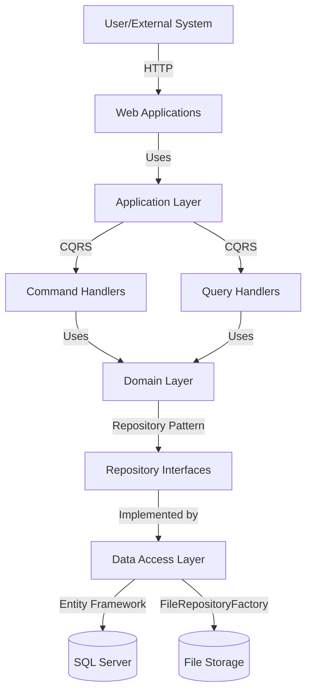

# PlataformaRio2C (MyRio2C) Project Overview

[](https://dotnet.microsoft.com/download/dotnet-framework/net48)
[](https://www.microsoft.com/en-us/sql-server/sql-server-2022)
[](https://docs.microsoft.com/en-us/ef/ef6/)

## 1. Project Description and Purpose

PlataformaRio2C (also known as MyRio2C) is a comprehensive event management platform designed specifically for Rio2C, a major creative industry event in Brazil. The platform serves as a central hub connecting professionals from various creative sectors including Audiovisual, Music, Innovation, and Cartoon/Creator content.

The primary purpose of this platform is to facilitate:
- Event organization and management
- Participant registration and profile management
- Project submissions across different creative sectors
- Business matchmaking and meeting scheduling
- Networking opportunities between attendees
- Conference scheduling and management

The system is designed with a multi-tenant architecture that supports different editions of the Rio2C event, with specialized functionality for each creative sector while maintaining a consistent user experience.

## 2. Key Features and Functionality

### Core Features

- **Multi-sector Event Management**
  - Specialized modules for Audiovisual, Music, Innovation, and Cartoon/Creator areas
  - Configurable features for each sector's specific needs

- **User and Organization Management**
  - Multiple user roles (Admin, AdminPartial, User) with appropriate permissions
  - Organization and collaborator profiles with detailed information
  - Integration with ticket sales platforms (Sympla)

- **Project Submission and Evaluation**
  - Specialized submission forms for each sector
  - Commission evaluation workflows
  - Buyer evaluation and interest tracking

- **Business Matchmaking**
  - Automated and manual meeting scheduling
  - Availability management and calendar integration
  - Meeting space allocation

- **Conference Management**
  - Track and room management
  - Speaker profiles and scheduling
  - Conference participant registration

- **Multilingual Support**
  - Built-in internationalization
  - Content translation management
  - Language preference settings

### Sector-Specific Features

#### Audiovisual Sector
- Project submission with detailed metadata
- Commission evaluation workflow
- Business round meeting scheduling
- Buyer-seller matchmaking

#### Music Sector
- Band/artist registration
- Business round project submission
- Music industry meetings

#### Innovation Sector
- Startup organization management
- Innovation track categorization
- Investor-startup matchmaking

#### Cartoon/Creator Sector
- Cartoon/creator project submission
- Project evaluation workflow
- Specialized metadata for animation projects

## 3. Technology Stack

### Core Framework and Languages

| Technology | Version | Purpose |
|------------|---------|---------|
| ASP.NET MVC | 5.2.7 | Web application framework |
| ASP.NET Web API | 5.2.7 | RESTful API framework |
| C# | .NET Framework 4.8 | Primary backend language |
| JavaScript | ES5/ES6 | Client-side functionality |
| HTML5/CSS3 | - | Frontend markup and styling |
| SQL Server | 2022 | Relational database |

### Architecture and Patterns

| Component | Implementation | Purpose |
|-----------|----------------|---------|
| Architecture | Domain-Driven Design (DDD) | Organize code around business concepts |
| Design Pattern | CQRS | Separate read and write operations |
| ORM | Entity Framework 6.4.0 | Database access layer |
| Dependency Injection | SimpleInjector 4.6.0 | Component management |

### Key Libraries and Components

#### Backend
| Library | Version | Purpose |
|---------|---------|---------|
| Entity Framework | 6.4.0 | Object-Relational Mapping |
| Z.EntityFramework.Extensions | 5.1.x+ | Bulk database operations |
| MediatR | 7.0.0 | In-process messaging for CQRS |
| SimpleInjector | 4.6.0 | Dependency Injection container |
| Newtonsoft.Json | 13.0.1 | JSON serialization |
| log4net | 2.0.12 | Logging framework |
| ELMAH | - | Error logging and monitoring |
| ClosedXML | 0.94.2 | Excel file manipulation |
| EPPlus | 4.5.3.2 | Excel file creation |
| iTextSharp | 5.5.13.2 | PDF generation |
| X.PagedList | 7.9.0 | Pagination |
| LazyCache | 2.0.1 | Memory caching |
| OWIN/Katana | 4.2.2 | Authentication middleware |

#### Frontend
| Library | Version | Purpose |
|---------|---------|---------|
| jQuery | 3.7.1 | DOM manipulation and AJAX |
| Bootstrap | 4.x | UI framework |
| Moment.js | - | Date/time handling |
| DataTables | - | Enhanced tables |
| Toastr | - | Notifications |
| Select2 | - | Enhanced select boxes |
| Metronic Theme | - | Admin theme framework |

### External Services and Integrations
| Service | Purpose |
|---------|---------|
| AWS S3 | File storage |
| SMTP | Email delivery |
| Sympla | Ticket sales platform integration |

## 4. Setup Instructions

### Prerequisites
- Visual Studio 2019 or 2022 with .NET Framework 4.8 SDK
- SQL Server 2022 (or Docker with SQL Server container)
- Git for source control
- NuGet Package Manager

### Development Environment Setup

#### Database Setup

**Option 1: Using Docker (Recommended)**
```bash
# Start SQL Server container
docker-compose up
```

This will start a SQL Server 2022 container with the following credentials:
- Username: sa
- Password: SqlServer2022!
- Port: 1433

**Option 2: Using Local SQL Server**
1. Install SQL Server 2022
2. Create a new database named `MyRio2C_Dev`
3. Update connection strings in Web.config files if necessary

#### Application Setup

1. **Clone the repository**
   ```bash
   git clone <repository-url>
   cd Rio2C-MyRio2C
   ```

2. **Build the solution to restore NuGet packages**
   ```
   # Using Visual Studio:
   # Ctrl + Shift + B or right-click on solution > Build Solution
   ```
   Multiple builds might be necessary to download all NuGet packages.

3. **Update Z.EntityFramework.Extensions package** (required annually)
   ```
   # In Package Manager Console:
   Update-Package Z.EntityFramework.Extensions
   ```

4. **Run database migrations**
   ```
   # In Package Manager Console:
   Update-Database -Project PlataformaRio2C.Infra.Data.Context
   ```

5. **Configure AWS credentials** (if using AWS S3 for file storage)
   Update the Web.config with your AWS credentials:
   ```xml
   <add key="AWSAccessKey" value="your-access-key" />
   <add key="AWSSecretKey" value="your-secret-key" />
   <add key="AWSBucket" value="your-bucket-name" />
   ```

6. **Run the application**
   - Set PlataformaRio2C.Web.Admin or PlataformaRio2C.Web.Site as the startup project
   - Press F5 to start debugging

### Environment Configuration

The application supports multiple environments through Web.config transformations:
- Web.Debug.config: Development environment
- Web.Test.config: Testing/QA environment
- Web.Release.config: Production environment

The environment is determined by the `ENVIRONMENT` setting in the Web.config:
```xml
<add key="ENVIRONMENT" value="dev" />
```

Valid environment values:
- `dev`: Development
- `test`: Testing/QA
- `prod`: Production

## 5. Repository Structure

The solution follows a layered architecture with Domain-Driven Design principles:

```
PlataformaRio2C/
├── documentation/                    # Project documentation
│   ├── database-structure.md         # Database documentation
│   ├── project-overview.md           # This overview document
│   └── tech-stack.md                 # Detailed technology stack
├── docker-compose.yml                # Docker configuration for SQL Server
└── source/                           # Main source code
    ├── Application/                  # Application layer
    │   ├── PlataformaRio2C.Application/      # Application services
    │   │   ├── CQRS/                         # CQRS implementation
    │   │   ├── Common/                        # Common services
    │   │   ├── Services/                      # Business services
    │   │   └── ViewModels/                    # View models
    │   └── PlataformaRio2C.HubApplication/    # Real-time hub services
    ├── Domain/                       # Domain layer
    │   └── PlataformaRio2C.Domain/   # Core domain models
    │       ├── ApiModels/                     # API models
    │       ├── Constants/                     # Constants and enums
    │       ├── Dtos/                          # Data transfer objects
    │       ├── Entities/                      # Domain entities
    │       ├── Enums/                         # Enumeration types
    │       ├── Interfaces/                    # Domain interfaces
    │       └── Validation/                    # Domain validation
    ├── Infra/                        # Infrastructure layer
    │   ├── CrossCutting/                      # Cross-cutting concerns
    │   │   ├── CQRS/                          # CQRS infrastructure
    │   │   ├── IOC/                           # Dependency injection
    │   │   ├── Identity/                      # Authentication
    │   │   ├── Resources/                     # Localization
    │   │   ├── SystemParameter/               # System parameters
    │   │   └── Tools/                         # Utility tools
    │   ├── Data/                              # Data access
    │   │   ├── Context/                       # Database context
    │   │   ├── Repository/                    # Data repositories
    │   │   └── FileRepository/                # File storage
    │   └── Report/                            # Reporting services
    ├── Presentation/                 # Presentation layer
    │   └── Web/
    │       ├── PlataformaRio2C.Web.Admin/     # Admin portal
    │       └── PlataformaRio2C.Web.Site/      # User-facing website
    └── Services/                     # Service layer
        └── PlataformaRio2C.WebApi/            # REST API endpoints
```

### Key Directories Explained

#### Application Layer
Contains application services that orchestrate use cases by using domain entities and repositories. Implements the CQRS pattern with commands and queries.

#### Domain Layer
Contains the core business logic, entities, and business rules. This layer is independent of specific technologies or frameworks.

#### Infrastructure Layer
- **Data**: Implements repositories and data access logic using Entity Framework.
- **CrossCutting**: Contains services that are used across different layers (logging, security, etc.).
- **Report**: Implements report generation logic.

#### Presentation Layer
Contains the user interfaces (Admin portal and User website) that consume the application services.

#### Services Layer
Contains the API endpoints that expose functionality to external clients.

## 6. Architecture Overview

The application follows a layered architecture with Domain-Driven Design principles and the CQRS pattern:



### Key Design Patterns

- **Domain-Driven Design (DDD)**: The application is organized around business concepts and domain models.
- **Command-Query Responsibility Segregation (CQRS)**: Separates read and write operations for better scalability and maintainability.
- **Repository Pattern**: Abstracts data access logic and provides a consistent interface for working with domain entities.
- **Unit of Work**: Manages transactions and ensures database consistency.
- **Dependency Injection**: Uses SimpleInjector to manage dependencies and promote loose coupling.

## 7. Basic Usage Examples

### User Management

```csharp
// Creating a new user
var command = new CreateUserCommand
{
    Email = "user@example.com",
    Password = "securePassword",
    FirstName = "John",
    LastName = "Doe",
    Role = UserRoles.User
};

var result = await _mediator.Send(command);

// Retrieving user information
var query = new GetUserByIdQuery { Id = userId };
var user = await _mediator.Send(query);
```

### Project Submission

```csharp
// Creating a new audiovisual project
var command = new CreateAudiovisualProjectCommand
{
    Title = "Project Title",
    Summary = "Project summary",
    ProjectTypeId = 1, // Feature film
    SellerAttendeeOrganizationId = organizationId,
    // Additional project data
};

var result = await _mediator.Send(command);
```

### Meeting Scheduling

```csharp
// Scheduling a meeting
var command = new ScheduleMeetingCommand
{
    BuyerAttendeeCollaboratorId = buyerId,
    SellerAttendeeCollaboratorId = sellerId,
    ProjectId = projectId,
    StartDateTime = startDateTime,
    EndDateTime = endDateTime,
    EditionId = currentEditionId
};

var result = await _mediator.Send(command);
```

### API Integration

```javascript
// JavaScript example for API integration
const apiBaseUrl = "https://api.rio2c.com";

// Authentication
async function login(email, password) {
  const response = await fetch(`${apiBaseUrl}/api/auth/login`, {
    method: "POST",
    headers: {
      "Content-Type": "application/json"
    },
    body: JSON.stringify({ email, password })
  });
  
  const data = await response.json();
  localStorage.setItem("authToken", data.token);
  return data;
}

// Fetching projects
async function getProjects() {
  const response = await fetch(`${apiBaseUrl}/api/projects`, {
    headers: {
      "Authorization": `Bearer ${localStorage.getItem("authToken")}`
    }
  });
  
  return await response.json();
}
```

## Additional Information

### Database Structure

The database uses Entity Framework Code First with a SQL-based migration approach. Migrations are created with custom SQL scripts that can be targeted to specific environments. For more details, see [database-structure.md](database-structure.md).

### Technology Stack Details

For a comprehensive overview of all technologies, libraries, and patterns used in the project, see [tech-stack.md](tech-stack.md).

### Contributing

1. Create a feature branch from `develop`
2. Make your changes
3. Submit a pull request to merge back into `develop`
4. After testing, changes will be promoted to `test` and eventually to `prod`