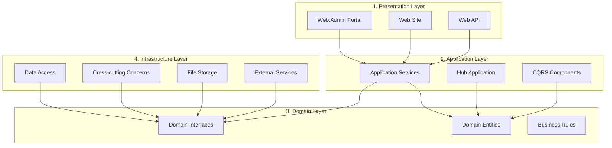
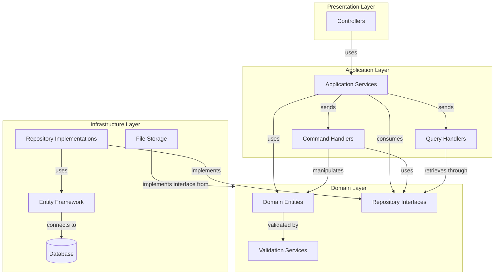
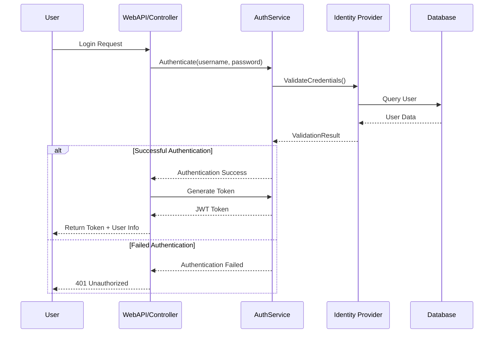
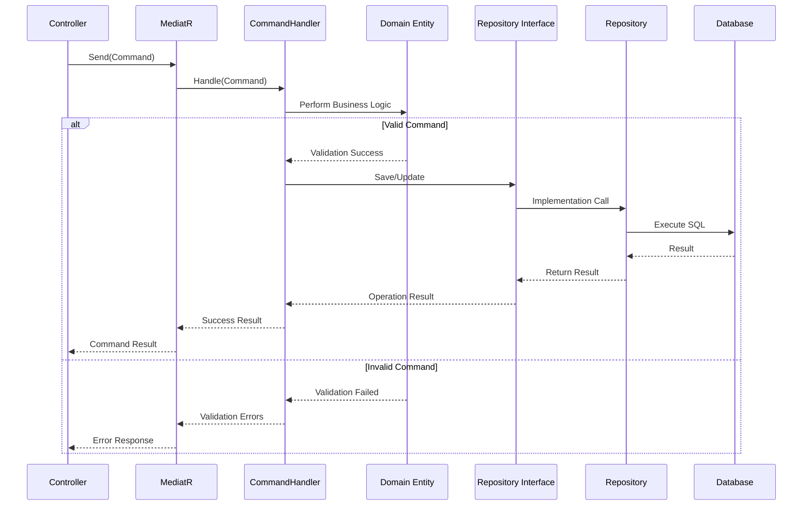
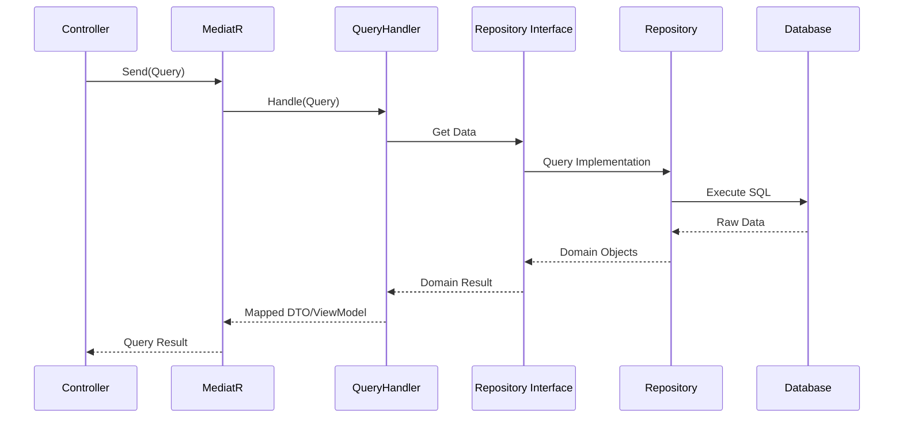
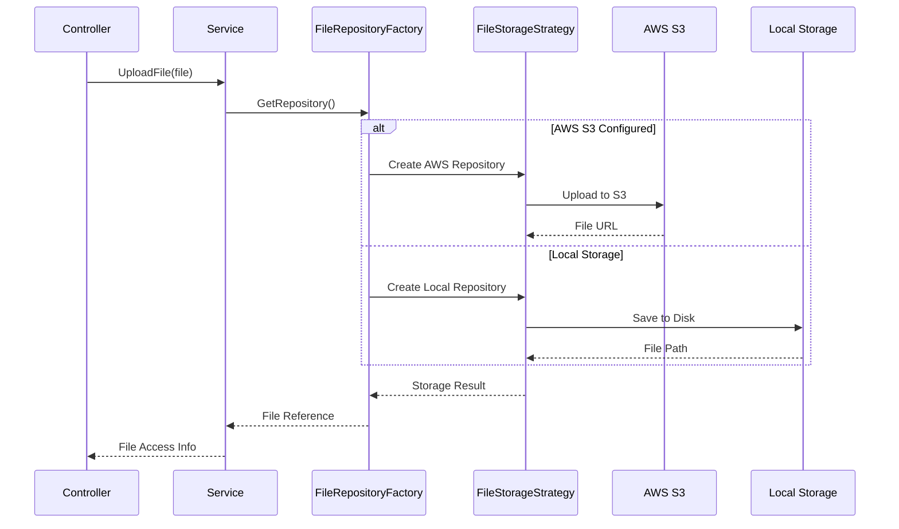
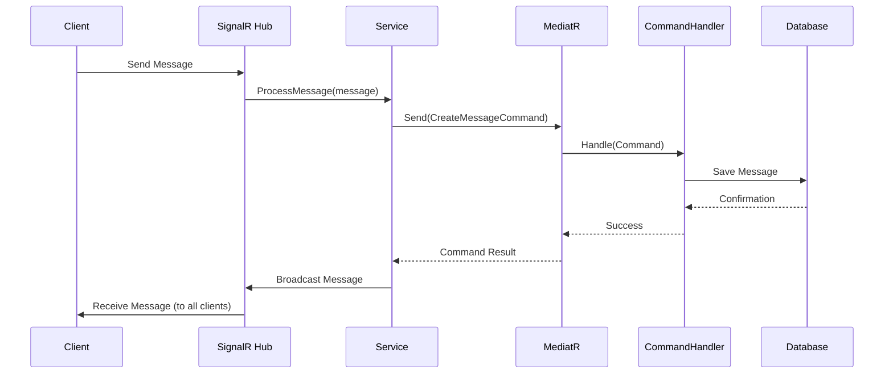
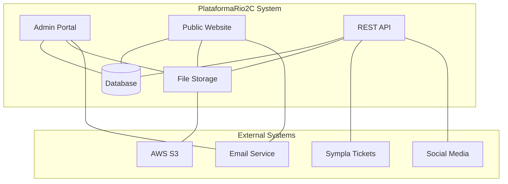

# PlataformaRio2C Architecture Documentation

## Table of Contents

1. [Overall System Architecture](#1-overall-system-architecture)
2. [Component Relationships and Dependencies](#2-component-relationships-and-dependencies)
3. [Data Flow Diagrams](#3-data-flow-diagrams)
4. [Design Patterns Implemented](#4-design-patterns-implemented)
5. [Technical Decisions and Rationales](#5-technical-decisions-and-rationales)
6. [System Boundaries and External Integrations](#6-system-boundaries-and-external-integrations)
7. [Detailed Component Analysis](#7-detailed-component-analysis)

## 1. Overall System Architecture

PlataformaRio2C implements a clean, multi-layered architecture following Domain-Driven Design (DDD) principles. The system is organized into distinct layers with clear separation of concerns:



### Key Components by Layer

#### 1. Presentation Layer
- **PlataformaRio2C.Web.Admin**: Administration portal for event management
- **PlataformaRio2C.Web.Site**: User-facing website for participants
- **PlataformaRio2C.WebApi**: REST API for external access and mobile applications

#### 2. Application Layer
- **PlataformaRio2C.Application**: Application services implementing use cases
  - CQRS implementation (Commands, Queries, Handlers)
  - ViewModels and DTOs
  - Service interfaces and implementations
- **PlataformaRio2C.HubApplication**: Real-time communication services

#### 3. Domain Layer
- **PlataformaRio2C.Domain**: Core business logic and entities
  - Domain entities and aggregates
  - Repository interfaces
  - Business rules and validation
  - Domain events and services

#### 4. Infrastructure Layer
- **Data Access**
  - PlataformaRio2C.Infra.Data.Context: Database context and migrations
  - PlataformaRio2C.Infra.Data.Repository: Repository implementations
  - PlataformaRio2c.Infra.Data.FileRepository: File storage implementations
- **Cross-cutting Concerns**
  - PlataformaRio2C.Infra.CrossCutting.CQRS: CQRS infrastructure
  - PlataformaRio2C.Infra.CrossCutting.IOC: Dependency injection
  - PlataformaRio2C.Infra.CrossCutting.Identity: Authentication
  - PlataformaRio2C.Infra.CrossCutting.Resources: Localization
  - PlataformaRio2C.Infra.CrossCutting.Tools: Utilities and helpers
  - PlataformaRio2C.Infra.CrossCutting.SystemParameter: Configuration
  - PlataformaRio2C.Infra.CrossCutting.SalesPlatforms: Sales platform integrations
  - PlataformaRio2C.Infra.CrossCutting.SocialMediaPlatforms: Social media integrations
- **Report Services**
  - PlataformaRio2C.Infra.Report: Report generation

### Domain-specific Components

The system supports multiple event sectors with specialized functionality for each:

- **Audiovisual Sector**: Project submission, commission evaluation, business round meetings
- **Music Sector**: Band/artist registration, business round project submission, industry meetings
- **Innovation Sector**: Startup organization management, track-based categorization
- **Cartoon/Creator Sector**: Cartoon/creator project submission and evaluation

## 2. Component Relationships and Dependencies

The system adheres to the Dependency Inversion Principle, ensuring that:

1. High-level modules (Application, Domain) do not depend on low-level modules (Infrastructure)
2. Both depend on abstractions (interfaces)
3. Abstractions do not depend on details; details depend on abstractions



### Key Dependencies

1. **Presentation → Application**
   - Controllers depend on application services
   - MVC controllers use ViewModels defined in application layer
   - API controllers consume DTOs from domain layer

2. **Application → Domain**
   - Application services use domain entities and repository interfaces
   - Command handlers manipulate domain state
   - Query handlers retrieve domain data

3. **Infrastructure → Domain**
   - Repositories implement domain interfaces
   - Concrete implementations reference domain entities

4. **Cross-cutting Dependencies**
   - All layers may use localization resources
   - Authentication services are used across layers
   - Dependency injection wires everything together

### Dependency Injection

The system uses SimpleInjector for dependency injection, with configuration centralized in:

- **IoCBootStrapper**: Main application DI configuration
- **HubBootStrapper**: Real-time hub DI configuration
- **SiteIoCBootStrapper**: Website-specific DI configuration

Components are registered following established DI patterns:
- Transient: New instance per request
- Scoped: Same instance within an HTTP request
- Singleton: Single instance for application lifetime

## 3. Data Flow Diagrams

### Authentication Flow



### CQRS Command Flow



### CQRS Query Flow



### File Storage Flow



### Real-time Communication Flow



## 4. Design Patterns Implemented

The PlataformaRio2C system implements several established design patterns throughout its codebase:

### Domain-Driven Design (DDD)

The entire architecture follows Domain-Driven Design principles:

- **Entity Pattern**: Core business objects with identity and lifecycle (e.g., `Collaborator`, `Organization`, `Project`)
  ```csharp
  // Base Entity class
  public abstract class Entity
  {
      public int Id { get; set; }
      public Guid Uid { get; set; }
      public bool IsDeleted { get; set; }
      public DateTimeOffset CreateDate { get; set; }
      public int CreateUserId { get; set; }
      public DateTimeOffset UpdateDate { get; set; }
      public int UpdateUserId { get; set; }
      
      public virtual bool IsValid()
      {
          // Validation logic
      }
  }
  ```

- **Aggregate Root Pattern**: Clusters of domain objects treated as a unit (e.g., `Organization` with its descriptions, activities, etc.)
  ```csharp
  // AggregateRoot marker class
  public abstract class AggregateRoot : Entity
  {
      // Aggregate root specific behavior
  }
  ```

- **Repository Pattern**: Data access abstraction with domain-focused interface
  ```csharp
  // Repository interface in domain layer
  public interface IProjectRepository
  {
      Project GetById(int id);
      IEnumerable<Project> GetByOrganization(int organizationId);
      void Save(Project project);
      // Other methods
  }
  ```

- **Domain Service Pattern**: Operations that don't naturally fit in entities
  ```csharp
  // Domain service example
  public class ProjectEvaluationService
  {
      public ValidationResult EvaluateProject(Project project, User evaluator, EvaluationCriteria criteria)
      {
          // Domain logic for project evaluation
      }
  }
  ```

### Command Query Responsibility Segregation (CQRS)

CQRS is implemented with MediatR for command and query handling:

- **Command Pattern**: Write operations represented as commands
  ```csharp
  // Command example
  public class CreateProjectCommand : BaseCommand
  {
      public string Title { get; set; }
      public string Summary { get; set; }
      public int ProjectTypeId { get; set; }
      public int SellerOrganizationId { get; set; }
      // Other properties
  }
  ```

- **Command Handler Pattern**: Process commands and produce results
  ```csharp
  // Command handler example
  public class CreateProjectCommandHandler : IRequestHandler<CreateProjectCommand, AppValidationResult>
  {
      private readonly IProjectRepository _projectRepository;
      private readonly IUnitOfWork _unitOfWork;
      
      // Constructor with dependencies
      
      public async Task<AppValidationResult> Handle(CreateProjectCommand command, CancellationToken cancellationToken)
      {
          // Validation, business logic, and persistence
      }
  }
  ```

- **Query Pattern**: Read operations that return data
  ```csharp
  // Query example
  public class GetProjectByIdQuery : BaseQuery<ProjectDto>
  {
      public int Id { get; set; }
  }
  ```

- **Query Handler Pattern**: Process queries and return data
  ```csharp
  // Query handler example
  public class GetProjectByIdQueryHandler : IRequestHandler<GetProjectByIdQuery, ProjectDto>
  {
      private readonly IProjectRepository _projectRepository;
      
      // Constructor with dependencies
      
      public async Task<ProjectDto> Handle(GetProjectByIdQuery query, CancellationToken cancellationToken)
      {
          // Data retrieval and mapping logic
      }
  }
  ```

### Repository Pattern

The repository pattern abstracts data access:

- **Generic Repository**: Common operations for all entities
  ```csharp
  // Generic repository interface
  public interface IRepository<TEntity> where TEntity : Entity
  {
      TEntity GetById(int id);
      IEnumerable<TEntity> GetAll();
      void Add(TEntity entity);
      void Update(TEntity entity);
      void Remove(TEntity entity);
  }
  ```

- **Specialized Repositories**: Domain-specific query methods
  ```csharp
  // Specialized repository
  public interface ICollaboratorRepository : IRepository<Collaborator>
  {
      IEnumerable<Collaborator> GetByOrganization(int organizationId);
      Collaborator GetByEmail(string email);
      // Other specialized methods
  }
  ```

### Factory Pattern

Factories create complex objects:

- **Repository Factory**: Creates repository instances
  ```csharp
  // Repository factory
  public class RepositoryFactory : IRepositoryFactory
  {
      private readonly PlataformaRio2CContext _context;
      
      // Constructor
      
      public TRepository Create<TRepository>() where TRepository : class
      {
          // Repository creation logic
      }
  }
  ```

- **File Repository Factory**: Creates file storage repositories
  ```csharp
  // File repository factory
  public class FileRepositoryFactory : IFileRepositoryFactory
  {
      public IFileRepository GetRepository()
      {
          var fileHost = ConfigurationManager.AppSettings["FileHost"];
          
          if (fileHost.Equals("aws", StringComparison.OrdinalIgnoreCase))
              return new FileAwsRepository();
              
          return new FileLocalRepository();
      }
  }
  ```

### Strategy Pattern

Different strategies for the same operation:

- **File Storage Strategy**: AWS S3 vs. Local storage
  ```csharp
  // File repository interface (strategy interface)
  public interface IFileRepository
  {
      string SaveFile(string filePath, MemoryStream stream, string contentType);
      bool DeleteFile(string filePath);
      Stream GetFile(string filePath);
  }
  
  // AWS S3 implementation
  public class FileAwsRepository : IFileRepository
  {
      // AWS S3 implementation
  }
  
  // Local storage implementation
  public class FileLocalRepository : IFileRepository
  {
      // Local storage implementation
  }
  ```

### Unit of Work Pattern

Manages transactions and persistence:

```csharp
// Unit of work interface
public interface IUnitOfWork : IDisposable
{
    void BeginTransaction();
    int Commit();
    void Rollback();
}

// Implementation with EF
public class UnitOfWork : IUnitOfWork
{
    private readonly PlataformaRio2CContext _context;
    private DbContextTransaction _transaction;
    
    // Methods implementing the interface
}
```

### Dependency Injection Pattern

SimpleInjector manages dependencies:

```csharp
// Registration example
public static class IoCBootStrapper
{
    public static Container Container { get; private set; }
    
    public static void RegisterServices(Container container)
    {
        Container = container;
        
        // Register services and repositories
        container.Register<IUnitOfWork, UnitOfWork>(Lifestyle.Scoped);
        container.Register<IRepositoryFactory, RepositoryFactory>(Lifestyle.Scoped);
        container.Register<IFileRepositoryFactory, FileRepositoryFactory>(Lifestyle.Singleton);
        
        // Register all repositories
        container.Register(typeof(IRepository<>), typeof(Repository<>), Lifestyle.Scoped);
        
        // Register application services
        container.Register<IUserAppService, UserAppService>(Lifestyle.Scoped);
        // Other registrations
    }
}
```

## 5. Technical Decisions and Rationales

### 1. ASP.NET MVC & .NET Framework 4.8

**Decision**: Build on ASP.NET MVC with .NET Framework 4.8 instead of newer .NET Core.

**Rationale**:
- Enterprise-grade framework with robust ecosystem
- Strong typing and compilation benefits
- Integration with Microsoft technologies
- Team expertise and compatibility with existing systems
- Mature framework with established patterns
- Compatibility with legacy dependencies

### 2. Domain-Driven Design Architecture

**Decision**: Implement a layered architecture following DDD principles.

**Rationale**:
- Clear separation of concerns
- Business logic isolated in domain layer
- Maintainable and testable structure
- Models business concepts directly
- Handles complex domains effectively
- Promotes ubiquitous language between developers and domain experts

### 3. CQRS Pattern with MediatR

**Decision**: Implement Command Query Responsibility Segregation with MediatR.

**Rationale**:
- Separation of read and write operations
- Independent scaling of read and write sides
- Clear organization of business logic in handlers
- Simplified controllers with delegated processing
- Support for cross-cutting concerns (validation, logging)
- Facilitates application of different optimizations for reads vs. writes

### 4. Entity Framework with Code First Approach

**Decision**: Use Entity Framework 6.x with a Code First approach and custom SQL migrations.

**Rationale**:
- Domain-driven design approach with model-first development
- Clean domain models without persistence concerns
- Database schema evolution through migrations
- Custom SQL migrations for fine-grained control
- Environment-specific migrations for deployment flexibility
- Integration with SQL Server features

### 5. SimpleInjector for Dependency Injection

**Decision**: Use SimpleInjector as DI container instead of built-in ASP.NET DI.

**Rationale**:
- High-performance dependency injection container
- Comprehensive diagnostic tools for DI issues
- Support for advanced registration scenarios
- Mature API with extensive documentation
- Integration with ASP.NET MVC/Web API
- Better support for generic type registrations

### 6. Multiple Storage Strategies

**Decision**: Implement abstracted file storage supporting both AWS S3 and local file system.

**Rationale**:
- Environment flexibility (development vs. production)
- Abstraction allows changing storage strategy without code changes
- Cloud storage benefits for production
- Local storage simplicity for development
- Strategy pattern implementation maintains clean architecture

### 7. Custom SQL-Based Migrations

**Decision**: Use Entity Framework migrations with direct SQL scripts.

**Rationale**:
- Precise control over database schema changes
- Supports complex operations not easily expressed in Code First
- Enables environment-specific migrations
- Makes database changes more explicit and reviewable
- Better performance for complex migrations
- Direct SQL can be optimized for specific scenarios

### 8. Soft Delete Pattern

**Decision**: Implement soft deletes (IsDeleted flag) instead of physical record deletion.

**Rationale**:
- Preserves historical data and relationships
- Enables data recovery if needed
- Maintains referential integrity
- Allows for data auditing
- Simplifies historical reporting
- Prevents cascade delete issues

## 6. System Boundaries and External Integrations

### System Boundaries



### External Integrations

#### 1. AWS S3 Integration

The system integrates with AWS S3 for file storage:

```csharp
// AWS S3 configuration in Web.config
<add key="AWSAccessKey" value="***" />
<add key="AWSSecretKey" value="***" />
<add key="AWSBucket" value="dev.assets.my.rio2c.com" />
```

Implementation in `FileAwsRepository.cs`:
```csharp
public class FileAwsRepository : IFileRepository
{
    private readonly IAmazonS3 _s3Client;
    private readonly string _bucketName;
    
    public FileAwsRepository()
    {
        var accessKey = ConfigurationManager.AppSettings["AWSAccessKey"];
        var secretKey = ConfigurationManager.AppSettings["AWSSecretKey"];
        _bucketName = ConfigurationManager.AppSettings["AWSBucket"];
        
        _s3Client = new AmazonS3Client(accessKey, secretKey, RegionEndpoint.USEast1);
    }
    
    public string SaveFile(string filePath, MemoryStream stream, string contentType)
    {
        // AWS S3 upload implementation
    }
    
    // Other methods
}
```

#### 2. Sympla Ticket Sales Integration

The system integrates with Sympla for ticket sales:

```csharp
// Sympla integration service
public class SympiaTicketService : ITicketService
{
    public async Task<TicketValidationResult> ValidateTicket(string ticketCode)
    {
        // Sympla API call to validate ticket
    }
    
    public async Task<IEnumerable<TicketDto>> GetUserTickets(string userEmail)
    {
        // Sympla API call to get user tickets
    }
}
```

#### 3. Email Service Integration

Email services are implemented with SMTP:

```csharp
// Email service implementation
public class MailerService : IMailerService
{
    public async Task SendEmail(string template, EmailRecipientDto recipient, string subject, Dictionary<string, string> replacements)
    {
        // Load email template
        var templateContent = GetEmailTemplate(template);
        
        // Apply replacements
        foreach (var replacement in replacements)
        {
            templateContent = templateContent.Replace($"{{{{{replacement.Key}}}}}", replacement.Value);
        }
        
        // Create and send email
        using (var smtpClient = new SmtpClient())
        {
            var message = new MailMessage
            {
                From = new MailAddress(ConfigurationManager.AppSettings["EmailFrom"]),
                Subject = subject,
                Body = templateContent,
                IsBodyHtml = true
            };
            
            message.To.Add(new MailAddress(recipient.Email, recipient.Name));
            await smtpClient.SendMailAsync(message);
        }
    }
}
```

#### 4. Social Media Platform Integration

The system integrates with social media platforms:

```csharp
// Social media platform factory
public class SocialMediaPlatformServiceFactory : ISocialMediaPlatformServiceFactory
{
    public ISocialMediaPlatformService GetService(string platform)
    {
        switch (platform.ToLowerInvariant())
        {
            case "linkedin":
                return new LinkedInService();
            case "twitter":
                return new TwitterService();
            // Other platforms
            default:
                throw new ArgumentException($"Unsupported platform: {platform}");
        }
    }
}
```

### System Integration Approaches

1. **File Storage Integration**:
   - Abstraction through IFileRepository interface
   - Strategy pattern for different storage implementations
   - Configuration-driven selection

2. **Authentication Boundary**:
   - OWIN middleware for authentication
   - Token-based API authentication
   - Role-based and claims-based authorization

3. **API Integration Boundary**:
   - REST API with versioning
   - Swagger documentation
   - OAuth token-based authentication
   - JSON data exchange

## 7. Detailed Component Analysis

### CQRS Implementation Details

The CQRS implementation centers around:

1. **Command Objects**: Immutable request objects representing intentions
2. **Command Handlers**: Process commands and produce results
3. **Queries**: Data request objects
4. **Query Handlers**: Retrieve and transform data
5. **MediatR**: In-process messaging to connect commands/queries with handlers

Key components:

- **BaseCommand.cs**: Common properties for all commands
  ```csharp
  public abstract class BaseCommand : BaseUserRequest, IRequest<AppValidationResult>
  {
      // Common command properties
  }
  ```

- **BaseCommandHandler.cs**: Base implementation for command handlers
  ```csharp
  public abstract class BaseCommandHandler<TCommand> : IRequestHandler<TCommand, AppValidationResult>
      where TCommand : BaseCommand
  {
      protected readonly IUnitOfWork UnitOfWork;
      
      protected BaseCommandHandler(IUnitOfWork unitOfWork)
      {
          UnitOfWork = unitOfWork;
      }
      
      public abstract Task<AppValidationResult> Handle(TCommand command, CancellationToken cancellationToken);
  }
  ```

- **BaseQuery.cs**: Common properties for all queries
  ```csharp
  public abstract class BaseQuery<TResult> : BaseUserRequest, IRequest<TResult>
  {
      // Common query properties
  }
  ```

- **CQRSBootStrapper.cs**: Registers CQRS components with DI container
  ```csharp
  public static class CQRSBootStrapper
  {
      public static void RegisterMediatrHandlers(Container container)
      {
          // Register MediatR
          var assemblies = new[] 
          { 
              typeof(BaseCommand).Assembly,
              // Other assemblies containing handlers
          };
          
          container.RegisterMediator(assemblies);
          
          // Register pipeline behaviors
          container.Collection.Register(typeof(IPipelineBehavior<,>), new[]
          {
              typeof(ValidationBehavior<,>),
              typeof(LoggingBehavior<,>)
          });
      }
  }
  ```

### Domain Model Structure

The domain model is structured around:

1. **Base Entity**: Common identity and tracking properties
2. **Aggregates**: Domain clusters treated as units
3. **Value Objects**: Immutable concepts without identity
4. **Specifications**: Query specifications for filtering entities

Key components:

- **Entity.cs**: Base class for all entities
- **AggregateRoot.cs**: Marker for aggregates
- **Validation.cs**: Domain validation implementation

```csharp
// Entity base class
public abstract class Entity
{
    public int Id { get; set; }
    public Guid Uid { get; set; }
    public bool IsDeleted { get; set; }
    public DateTimeOffset CreateDate { get; set; }
    public int CreateUserId { get; set; }
    public DateTimeOffset UpdateDate { get; set; }
    public int UpdateUserId { get; set; }
    
    public virtual bool IsValid()
    {
        return true;
    }
}

// Aggregate root marker
public abstract class AggregateRoot : Entity
{
    // Aggregate root specific behavior
}

// Example domain entity
public class Organization : AggregateRoot
{
    public string Name { get; set; }
    public string CompanyName { get; set; }
    public string TradeName { get; set; }
    public string Website { get; set; }
    public int? HoldingId { get; set; }
    public int? AddressId { get; set; }
    
    // Navigation properties
    public virtual Holding Holding { get; set; }
    public virtual Address Address { get; set; }
    public virtual ICollection<OrganizationDescription> Descriptions { get; set; }
    public virtual ICollection<OrganizationActivity> Activities { get; set; }
    public virtual ICollection<OrganizationTargetAudience> TargetAudiences { get; set; }
    public virtual ICollection<OrganizationInterest> Interests { get; set; }
    
    // Domain methods
    public ValidationResult UpdateDetails(string name, string companyName, string tradeName)
    {
        // Validation and update logic
    }
    
    public override bool IsValid()
    {
        // Domain validation rules
    }
}
```

### Repository Implementation

Repositories follow this structure:

1. **IRepository<T>**: Generic repository interface
2. **Repository<T>**: Generic implementation using Entity Framework
3. **Specialized repositories**: Domain-specific interfaces and implementations
4. **RepositoryFactory**: Creates repositories

```csharp
// Generic repository implementation
public class Repository<TEntity> : IRepository<TEntity> where TEntity : Entity
{
    protected readonly PlataformaRio2CContext Context;
    protected readonly DbSet<TEntity> DbSet;
    
    public Repository(PlataformaRio2CContext context)
    {
        Context = context;
        DbSet = context.Set<TEntity>();
    }
    
    public virtual TEntity GetById(int id)
    {
        return DbSet.AsNoTracking()
            .FirstOrDefault(e => e.Id == id && !e.IsDeleted);
    }
    
    public virtual IEnumerable<TEntity> GetAll()
    {
        return DbSet.AsNoTracking()
            .Where(e => !e.IsDeleted)
            .ToList();
    }
    
    public virtual void Add(TEntity entity)
    {
        DbSet.Add(entity);
    }
    
    public virtual void Update(TEntity entity)
    {
        var entry = Context.Entry(entity);
        DbSet.Attach(entity);
        entry.State = EntityState.Modified;
    }
    
    public virtual void Remove(TEntity entity)
    {
        entity.IsDeleted = true;
        Update(entity);
    }
}

// Specialized repository
public class OrganizationRepository : Repository<Organization>, IOrganizationRepository
{
    public OrganizationRepository(PlataformaRio2CContext context) : base(context)
    {
    }
    
    public Organization GetByName(string name)
    {
        return DbSet.AsNoTracking()
            .FirstOrDefault(o => o.Name == name && !o.IsDeleted);
    }
    
    public IEnumerable<Organization> GetByHolding(int holdingId)
    {
        return DbSet.AsNoTracking()
            .Where(o => o.HoldingId == holdingId && !o.IsDeleted)
            .ToList();
    }
    
    // Other specialized methods
}
```

### Authentication and Authorization

The system implements:

1. **OWIN-based authentication**: Token and cookie authentication
2. **Role-based authorization**: Admin, AdminPartial, User roles
3. **Claims-based permissions**: Fine-grained access control

```csharp
// OWIN configuration
public partial class Startup
{
    public void ConfigureAuth(IAppBuilder app)
    {
        // Configure the database context and user manager
        app.CreatePerOwinContext(PlataformaRio2CContext.Create);
        app.CreatePerOwinContext<ApplicationUserManager>(ApplicationUserManager.Create);
        
        // Enable cookie authentication
        app.UseCookieAuthentication(new CookieAuthenticationOptions
        {
            AuthenticationType = DefaultAuthenticationTypes.ApplicationCookie,
            LoginPath = new PathString("/Account/Login"),
            Provider = new CookieAuthenticationProvider
            {
                OnValidateIdentity = SecurityStampValidator.OnValidateIdentity<ApplicationUserManager, ApplicationUser>(
                    validateInterval: TimeSpan.FromMinutes(30),
                    regenerateIdentity: (manager, user) => user.GenerateUserIdentityAsync(manager))
            }
        });
        
        // Enable OAuth bearer token authentication for API
        app.UseOAuthBearerAuthentication(new OAuthBearerAuthenticationOptions());
    }
}

// OAuth provider
public class AuthorizationApiServerProvider : OAuthAuthorizationServerProvider
{
    public override async Task ValidateClientAuthentication(OAuthValidateClientAuthenticationContext context)
    {
        context.Validated();
    }
    
    public override async Task GrantResourceOwnerCredentials(OAuthGrantResourceOwnerCredentialsContext context)
    {
        // Validate credentials and create identity with claims
    }
}
```

### Data Access and Migrations Strategy

The system uses Entity Framework with:

1. **Code First approach**: Domain model drives database schema
2. **Custom SQL migrations**: Direct SQL scripts for migrations
3. **Environment-specific migrations**: Migrations targeted to specific environments

```csharp
// Database context
public class PlataformaRio2CContext : DbContext
{
    public PlataformaRio2CContext() : base("PlataformaRio2CContext")
    {
        Configuration.LazyLoadingEnabled = true;
        Configuration.ProxyCreationEnabled = true;
        
        // Set command timeout for long-running queries
        ((IObjectContextAdapter)this).ObjectContext.CommandTimeout = 180;
    }
    
    // DbSets for entities
    public DbSet<User> Users { get; set; }
    public DbSet<Organization> Organizations { get; set; }
    public DbSet<Collaborator> Collaborators { get; set; }
    public DbSet<Project> Projects { get; set; }
    // Other DbSets
    
    protected override void OnModelCreating(DbModelBuilder modelBuilder)
    {
        // Apply entity configurations
        modelBuilder.Configurations.Add(new UserConfiguration());
        modelBuilder.Configurations.Add(new OrganizationConfiguration());
        modelBuilder.Configurations.Add(new CollaboratorConfiguration());
        modelBuilder.Configurations.Add(new ProjectConfiguration());
        // Other configurations
        
        base.OnModelCreating(modelBuilder);
    }
    
    // Static constructor for context creation
    public static PlataformaRio2CContext Create()
    {
        return new PlataformaRio2CContext();
    }
}

// Entity configuration example
public class OrganizationConfiguration : EntityTypeConfiguration<Organization>
{
    public OrganizationConfiguration()
    {
        // Table mapping
        ToTable("Organizations");
        
        // Primary key
        HasKey(e => e.Id);
        
        // Properties
        Property(e => e.Name).IsRequired().HasMaxLength(100);
        Property(e => e.CompanyName).HasMaxLength(100);
        Property(e => e.TradeName).HasMaxLength(100);
        Property(e => e.Website).HasMaxLength(255);
        
        // Relationships
        HasOptional(e => e.Holding)
            .WithMany()
            .HasForeignKey(e => e.HoldingId);
            
        HasOptional(e => e.Address)
            .WithMany()
            .HasForeignKey(e => e.AddressId);
    }
}

// Custom migration base class
public abstract class SqlMigration : DbMigration
{
    public override void Up()
    {
        if (ShouldExecuteMigration())
        {
            // Find and execute SQL script for up migration
            ExecuteSqlScript(GetType().Name, "up");
        }
    }
    
    public override void Down()
    {
        if (ShouldExecuteMigration())
        {
            // Find and execute SQL script for down migration
            ExecuteSqlScript(GetType().Name, "down");
        }
    }
    
    private bool ShouldExecuteMigration()
    {
        // Check if migration should run in current environment
        var attributes = GetType().GetCustomAttributes<EnvironmentVariableAttribute>(false);
        
        if (!attributes.Any())
            return true;
            
        var environment = ConfigurationManager.AppSettings["ENVIRONMENT"];
        return attributes.Any(a => a.Environments.Contains(environment));
    }
    
    private void ExecuteSqlScript(string migrationName, string direction)
    {
        // Find and execute SQL script
        var scriptPath = $"Scripts/{migrationName}.{direction}.sql";
        var script = File.ReadAllText(scriptPath);
        
        Sql(script);
    }
}

// Migration example
[EnvironmentVariable(EnumEnvironments.Development, EnumEnvironments.Test)]
public partial class CreateProjectTables : SqlMigration
{
    // Migration implementation uses SqlMigration base class
}
```

### Conclusion

PlataformaRio2C demonstrates a well-architected application with clear separation of concerns, following established architectural patterns and best practices. The domain-driven design approach, CQRS pattern, and layered architecture provide a maintainable and extensible foundation for the complex business requirements of the Rio2C event management platform.

The system's architecture allows for specialized functionality for different event sectors while maintaining a consistent approach and user experience. The use of established design patterns and architectural principles results in a codebase that is organized, testable, and able to evolve with changing business needs.