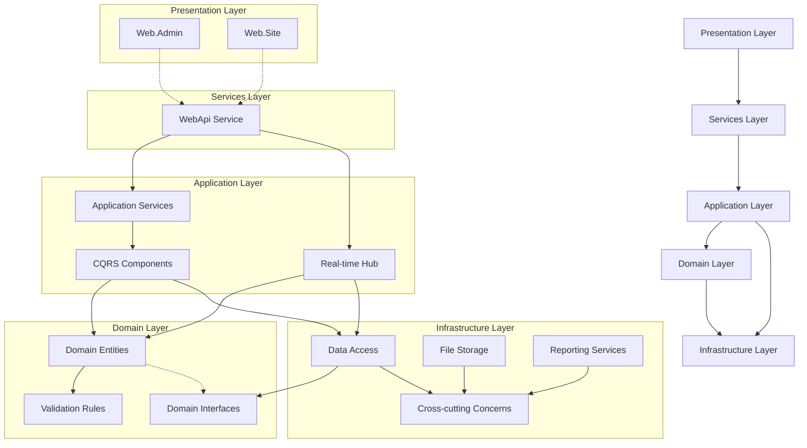
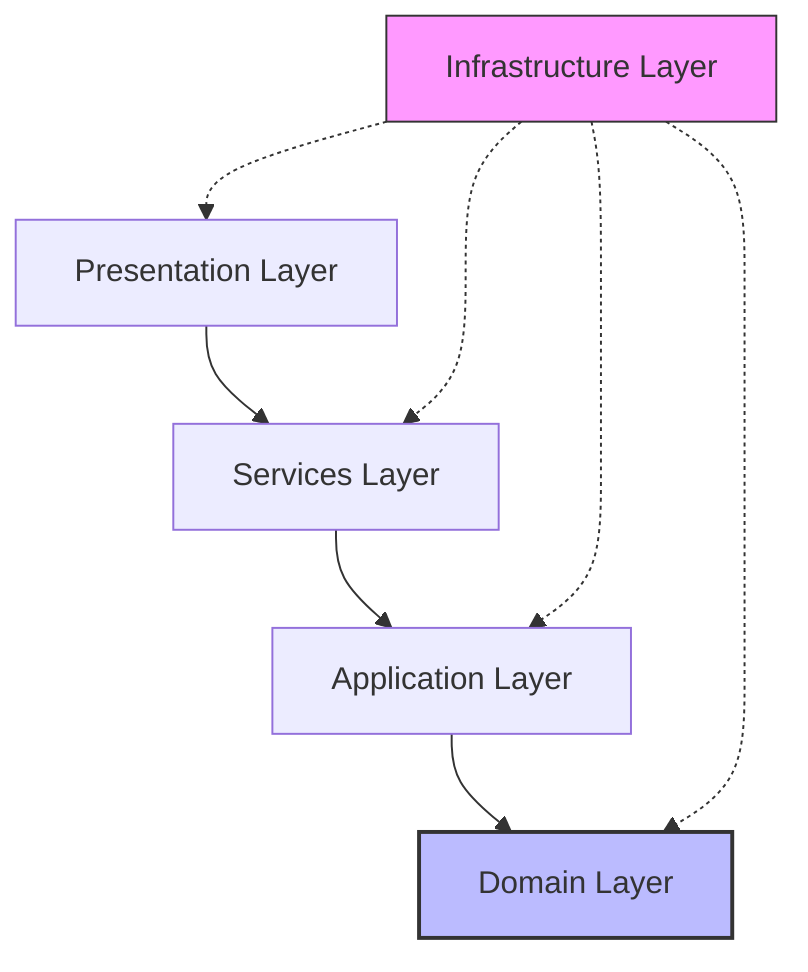
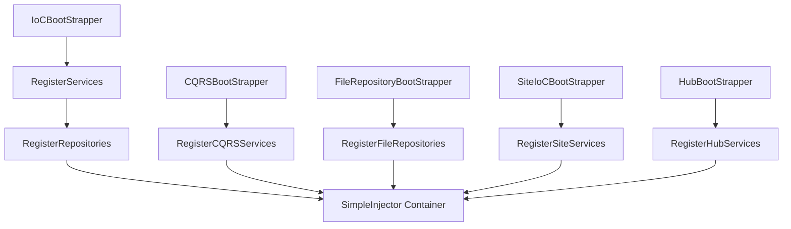
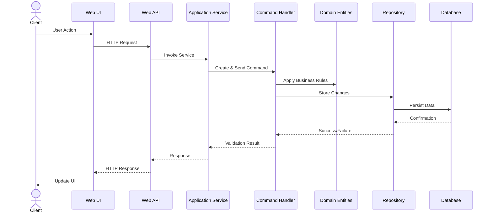
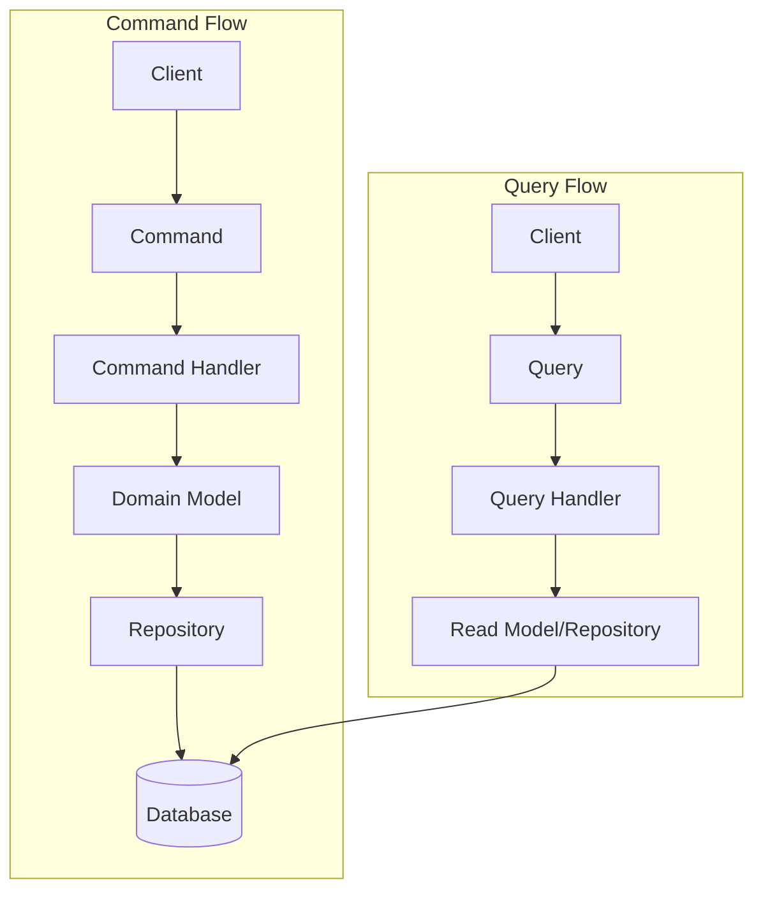
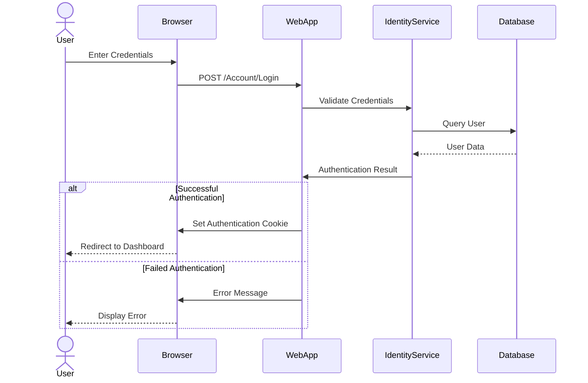
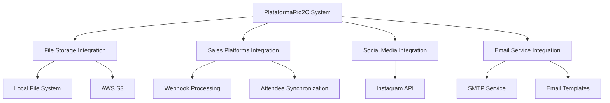

# PlataformaRio2C Architecture Documentation

## 1. Overall System Architecture

PlataformaRio2C (MyRio2C) is built using a multi-layered architecture following Domain-Driven Design (DDD) principles and the Command Query Responsibility Segregation (CQRS) pattern. The system is implemented as an ASP.NET MVC application with separation of concerns distributed across multiple layers, each with its own responsibility.

### Major Components

### Layer Responsibilities

1. **Presentation Layer**:
   - `PlataformaRio2C.Web.Admin`: Administrative interface for managing content, users, and events
   - `PlataformaRio2C.Web.Site`: User-facing website for participants to register, submit projects, and manage their profiles

2. **Services Layer**:
   - `PlataformaRio2C.WebApi`: REST API service exposing system functionality to front-end clients

3. **Application Layer**:
   - `PlataformaRio2C.Application`: Application services that orchestrate domain operations
   - `PlataformaRio2C.HubApplication`: Real-time communication hub for notifications and instant messaging
   - CQRS Components:
     - Commands: Data-changing operations
     - Queries: Data-retrieval operations
     - Command/Query Handlers: Process commands and queries

4. **Domain Layer**:
   - `PlataformaRio2C.Domain`: Core business entities, services, and validation rules
   - Domain Models: Business entities and aggregates
   - Validation Rules: Business validation logic
   - Interfaces: Repository and service interfaces

5. **Infrastructure Layer**:
   - Data:
     - `PlataformaRio2C.Infra.Data.Context`: Database context and entity mappings
     - `PlataformaRio2C.Infra.Data.Repository`: Repository implementations
     - `PlataformaRio2c.Infra.Data.FileRepository`: File storage implementations
   - Cross-cutting:
     - `PlataformaRio2C.Infra.CrossCutting.Identity`: Authentication and authorization
     - `PlataformaRio2C.Infra.CrossCutting.IOC`: Dependency injection configuration
     - `PlataformaRio2C.Infra.CrossCutting.CQRS`: CQRS framework integration
     - `PlataformaRio2C.Infra.CrossCutting.Resources`: Localization resources
     - `PlataformaRio2C.Infra.CrossCutting.Tools`: Common utilities
     - `PlataformaRio2C.Infra.CrossCutting.SalesPlatforms`: Sales platform integrations
     - `PlataformaRio2C.Infra.CrossCutting.SocialMediaPlatforms`: Social media integrations
   - Report:
     - `PlataformaRio2C.Infra.Report`: Report generation services

## 2. Component Relationships and Dependencies

### Dependency Flow

The PlataformaRio2C architecture follows the Dependency Inversion Principle, with dependencies flowing from outer layers inward:

The infrastructure layer (cross-cutting concerns) provides services to all layers but depends only on abstractions defined in the domain layer.

### Key Dependencies

1. **Web Projects → Application Layer**:
   - The Web.Admin and Web.Site projects depend on the Application layer for business operations
   - WebApi depends on Application services to process requests

2. **Application Layer → Domain Layer**:
   - Application services depend on domain entities and services
   - Command/Query handlers use domain repositories and services

3. **Infrastructure → Domain Interfaces**:
   - Repositories implement domain interfaces
   - Infrastructure services implement domain service interfaces

4. **Cross-Project Dependencies**:
   - CQRS components connect application and domain layers
   - IoC container wires up all dependencies

### Dependency Injection

The system uses SimpleInjector for dependency injection. Dependencies are registered in bootstrapper classes:

## 3. Data Flow Diagrams and Descriptions

### Request Processing Flow

### CQRS Data Flow

The system uses the CQRS pattern to separate read and write operations:

### Authentication Flow

## 4. Design Patterns Implemented

### Architectural Patterns

1. **Layered Architecture**:
   - Segregates the system into distinct layers
   - Each layer has a specific responsibility
   - Dependencies flow from outer to inner layers

2. **Domain-Driven Design (DDD)**:
   - Focus on core domain logic
   - Rich domain models with business rules
   - Separation of entities, value objects, and services

3. **Command Query Responsibility Segregation (CQRS)**:
   - Commands for state changes (write operations)
   - Queries for data retrieval (read operations)
   - Separate command and query handlers
   - MediatR for in-process messaging

### Structural Patterns

1. **Repository Pattern**:
   - Abstracts data persistence operations
   - Repositories for each domain entity
   - Generic repository implementation with type-specific extensions

2. **Unit of Work Pattern**:
   - Coordinates operations across multiple repositories
   - Ensures atomicity of related changes
   - Implemented in the `UnitOfWorkWithLog` class

3. **Dependency Injection (DI)**:
   - SimpleInjector for IoC container
   - Constructor injection throughout the codebase
   - Registered dependencies in bootstrapper classes

4. **Factory Pattern**:
   - `RepositoryFactory` for creating repositories
   - `FileRepositoryFactory` for file storage strategy
   - `SalesPlatformServiceFactory` for external service integration

### Behavioral Patterns

1. **Strategy Pattern**:
   - File storage strategy (AWS or local)
   - Configurable via application settings
   - Implemented through `IFileRepository` interface

2. **Mediator Pattern**:
   - MediatR for dispatching commands and queries
   - Decouples senders and receivers
   - Centralized request handling

3. **Template Method Pattern**:
   - Base handlers with common functionality
   - Specialized handlers for specific commands/queries

## 5. Technical Decisions and Rationales

### Framework and Language Selection

1. **ASP.NET MVC with .NET Framework 4.8**:
   - Mature framework with robust ecosystem
   - Strong typing and compilation benefits
   - Integration with Microsoft technologies

2. **Entity Framework 6.x with SQL Server**:
   - Object-relational mapping for data access
   - Code-first approach for entity definition
   - Integration with SQL Server

3. **CQRS Implementation**:
   - Separation of read and write operations
   - MediatR for command/query dispatching
   - Improved performance for read-heavy operations

### Architectural Decisions

1. **Domain-Driven Design (DDD)**:
   - Rationale: Complex business domain with sector-specific rules
   - Benefit: Focuses on core business logic and domain experts' language
   - Implementation: Rich domain models with business rules encapsulated in entities

2. **Multi-layered Architecture**:
   - Rationale: Separation of concerns and maintainability
   - Benefit: Modular development, testability, and scalability
   - Implementation: 5 distinct layers with clear responsibilities

3. **CQRS Pattern**:
   - Rationale: Different requirements for read and write operations
   - Benefit: Optimization of read/write paths, scalability
   - Implementation: Command/Query handlers with MediatR

### Technology Selection

1. **SimpleInjector for DI**:
   - Rationale: Performance and feature-rich DI container
   - Benefit: Registration by convention, diagnostic tools
   - Implementation: Bootstrapper classes for component registration

2. **AWS/Local File Storage**:
   - Rationale: Flexibility in deployment environments
   - Benefit: Development in local environment, production in cloud
   - Implementation: Strategy pattern with configurable implementation

3. **Localization and Internationalization**:
   - Rationale: Multi-language support requirement
   - Benefit: Global user base with localized content
   - Implementation: Resource files with culture-specific variations

## 6. System Boundaries and External Integrations

### System Boundaries

1. **User Interface Boundaries**:
   - Web interfaces (Admin and Site)
   - REST API for programmatic access
   - Real-time communication via SignalR hub

2. **Persistence Boundaries**:
   - SQL Server database for structured data
   - File storage (local or AWS S3) for unstructured data

3. **Authentication Boundaries**:
   - Custom identity implementation
   - Role-based access control
   - JWT token authentication for API

### External Integrations

1. **AWS S3 Integration**:
   - Purpose: Cloud-based file storage
   - Integration point: `FileAwsRepository` implementation
   - Configuration: AWS credentials in Web.config

2. **Sales Platform Integration**:
   - Purpose: Ticket sales and registration
   - Integration point: `SalesPlatformServiceFactory` 
   - Features: Webhook processing, participant synchronization

3. **Social Media Platform Integration**:
   - Purpose: Social media content aggregation
   - Integration point: `SocialMediaPlatformServiceFactory`
   - Features: Instagram publications synchronization

4. **Email Services**:
   - Purpose: Notification and communication
   - Integration point: SMTP configuration in Web.config
   - Features: Email templates for various system events

### Integration Patterns

## Conclusion

The PlataformaRio2C system follows a robust multi-layered architecture incorporating Domain-Driven Design principles and the CQRS pattern. It uses a variety of design patterns to address specific concerns and integrates with external systems through well-defined boundaries and interfaces. The architecture promotes maintainability, scalability, and separation of concerns while providing a flexible framework for implementing the complex business requirements of a multi-sector event management platform.