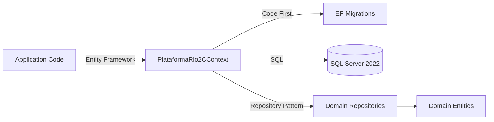
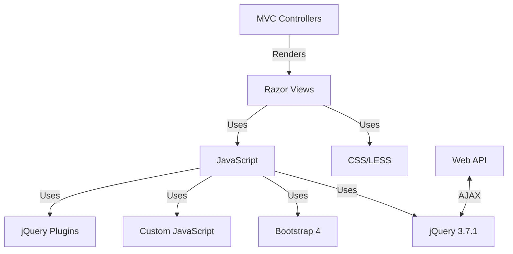
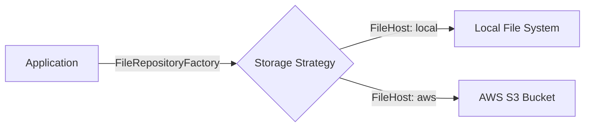
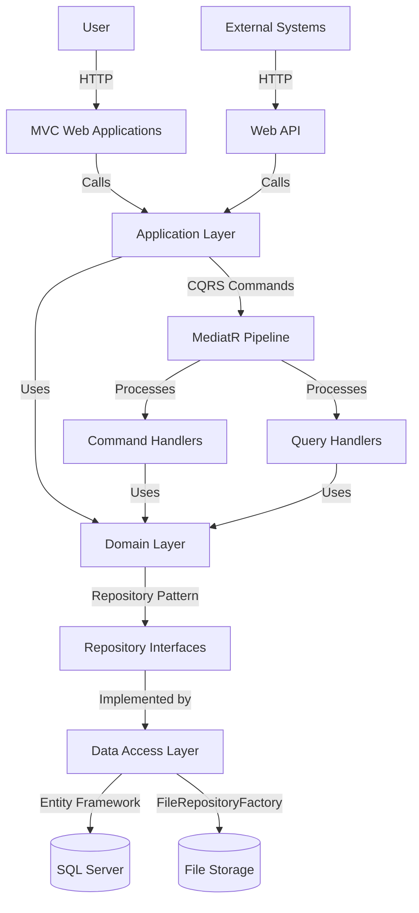
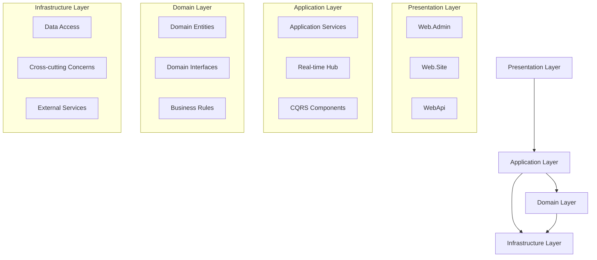
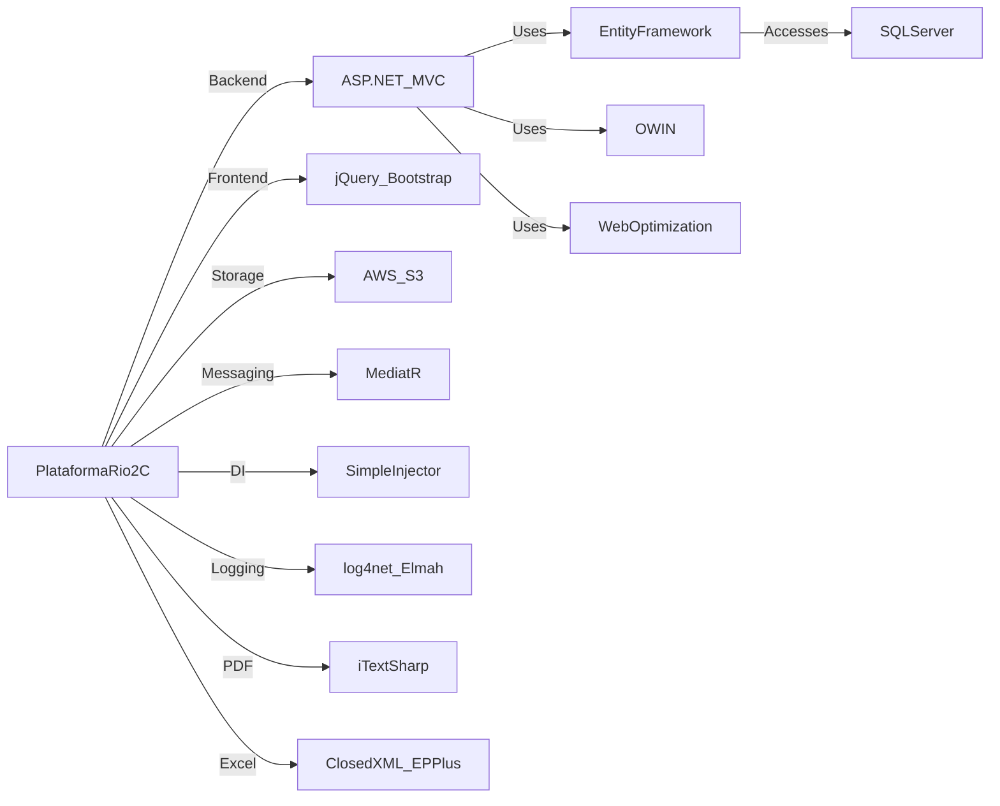

# PlataformaRio2C Tech Stack Documentation

## 1. Core Technologies

### Programming Languages

| Language | Version | Purpose |
|----------|---------|---------|
| C# | .NET Framework 4.8 | Primary backend language for server-side code |
| JavaScript | ES5/ES6 | Client-side scripting and frontend functionality |
| HTML5 | - | Markup language for web pages |
| CSS3 | - | Styling and presentation |
| SQL | T-SQL (SQL Server) | Database queries and stored procedures |

### Frameworks and Libraries

#### Backend

| Framework/Library | Version | Purpose | Documentation |
|-------------------|---------|---------|---------------|
| ASP.NET MVC | 5.2.7 | Web application framework | [Documentation](https://docs.microsoft.com/en-us/aspnet/mvc/overview/getting-started/introduction/getting-started) |
| ASP.NET Web API | 5.2.7 | RESTful API framework | [Documentation](https://docs.microsoft.com/en-us/aspnet/web-api/) |
| Entity Framework | 6.4.0 | Object-Relational Mapping (ORM) | [Documentation](https://docs.microsoft.com/en-us/ef/ef6/) |
| MediatR | 7.0.0 | In-process messaging for CQRS | [GitHub](https://github.com/jbogard/MediatR) |
| SimpleInjector | 4.6.0 | Dependency Injection container | [Documentation](https://docs.simpleinjector.org/en/latest/) |
| OWIN/Katana | 4.2.2 | Open Web Interface for .NET | [Documentation](https://docs.microsoft.com/en-us/aspnet/aspnet/overview/owin-and-katana/) |
| log4net | 2.0.12 | Logging framework | [Documentation](https://logging.apache.org/log4net/) |
| Elmah | - | Error logging and monitoring | [GitHub](https://github.com/elmah/elmah) |
| Newtonsoft.Json | 13.0.1 | JSON framework | [Documentation](https://www.newtonsoft.com/json/help/html/Introduction.htm) |
| ClosedXML | 0.94.2 | Excel file manipulation | [GitHub](https://github.com/ClosedXML/ClosedXML) |
| EPPlus | 4.5.3.2 | Excel file creation | [GitHub](https://github.com/JanKallman/EPPlus) |
| iTextSharp | 5.5.13.2 | PDF generation | [Documentation](https://itextpdf.com/en/products/itextsharp) |
| X.PagedList | 7.9.0 | Paging functionality | [GitHub](https://github.com/dncuug/X.PagedList) |
| LazyCache | 2.0.1 | Memory caching | [GitHub](https://github.com/alastairtree/LazyCache) |
| Z.EntityFramework.Extensions | 5.1.x+ | Entity Framework extensions for bulk operations | [Documentation](https://entityframework-extensions.net/) |

#### Frontend

| Framework/Library | Version | Purpose | Documentation |
|-------------------|---------|---------|---------------|
| jQuery | 3.7.1 | DOM manipulation and AJAX | [Documentation](https://api.jquery.com/) |
| Bootstrap | 4.x | UI framework | [Documentation](https://getbootstrap.com/docs/4.6/getting-started/introduction/) |
| Moment.js | - | Date/time manipulation | [Documentation](https://momentjs.com/docs/) |
| DataTables | - | Enhanced HTML tables | [Documentation](https://datatables.net/) |
| Toastr | - | Non-blocking notifications | [GitHub](https://github.com/CodeSeven/toastr) |
| Select2 | - | Enhanced select boxes | [Documentation](https://select2.org/) |
| Perfect Scrollbar | - | Custom scrollbars | [GitHub](https://github.com/mdbootstrap/perfect-scrollbar) |
| Metronic Theme | - | Admin theme framework | [Documentation](https://keenthemes.com/metronic/) |

### Database Systems

| Database | Version | Purpose | Documentation |
|----------|---------|---------|---------------|
| Microsoft SQL Server | 2022 | Primary relational database | [Documentation](https://docs.microsoft.com/en-us/sql/sql-server/) |
| Entity Framework | 6.4.0 | ORM for data access | [Documentation](https://docs.microsoft.com/en-us/ef/ef6/) |

#### Database Architecture



### Frontend Technologies

The frontend uses a combination of server-side rendering with Razor views and client-side enhancements:



## 2. Infrastructure & Deployment

### Hosting Environments

| Environment | Description | Configuration |
|-------------|-------------|---------------|
| Development | Local development environment | `Environment` value: `dev` |
| Test | Testing/QA environment | `Environment` value: `test` |
| Production | Live environment | `Environment` value: `prod` |

Configuration for different environments is managed through Web.config transformations:
- Web.Debug.config
- Web.Release.config
- Web.Test.config

### Containerization Tools

| Tool | Version | Purpose | Documentation |
|------|---------|---------|---------------|
| Docker | - | Container platform | [Documentation](https://docs.docker.com/) |
| Docker Compose | 3.4 | Multi-container definition | [Documentation](https://docs.docker.com/compose/) |

The project includes Docker support for SQL Server:

```yaml
# docker-compose.yml
version: '3.4'

services:
  sqlserver:
    container_name: sqlserver
    image: mcr.microsoft.com/mssql/server:2022-latest
    environment:
      MSSQL_SA_PASSWORD: "SqlServer2022!"
      ACCEPT_EULA: "Y"
      MSSQL_PID: "Developer"
    ports:
      - "1433:1433"
    volumes:
      - sqlserver_data:/var/opt/mssql

volumes:
  sqlserver_data:
    driver: local
```

### Cloud Services and Providers

| Service | Purpose | Configuration |
|---------|---------|---------------|
| AWS S3 | File storage | Configured in Web.config with AWS credentials |

The system supports both local and AWS S3 file storage:



### Monitoring and Logging Solutions

| Tool | Purpose | Implementation |
|------|---------|----------------|
| log4net | General application logging | Configured in Web.config |
| Elmah | Error logging and dashboard | Integrated into the application |
| Application Insights | Performance monitoring | Configured via ApplicationInsights.config |

## 3. Development Tools

### Build Tools and Task Runners

| Tool | Purpose | Configuration |
|------|---------|---------------|
| MSBuild | .NET build system | Part of Visual Studio |
| Web Optimization | Script and CSS bundling/minification | Configured in BundleConfig.cs |

### Package Managers

| Tool | Purpose | Configuration Files |
|------|---------|---------------------|
| NuGet | .NET package management | packages.config |
| Library Manager (Libman) | Client-side library management | libman.json |

### Version Control Workflows

| Branch | Purpose |
|--------|---------|
| develop | Development branch |
| test | Testing/QA branch |
| prod | Production branch |

The project follows a pull request workflow with branch-based development.

## 4. Third-party Integrations

### External Storage

| Integration | Purpose | Implementation |
|-------------|---------|----------------|
| AWS S3 | File storage | `FileAwsRepository.cs` using AWS SDK |

Configuration:
```xml
<!-- AWS File Configuration (S3) -->
<add key="AWSAccessKey" value="***" />
<add key="AWSSecretKey" value="***" />
<add key="AWSBucket" value="dev.assets.my.rio2c.com" />
```

### Authentication Providers

| Integration | Purpose | Implementation |
|-------------|---------|----------------|
| Custom OAuth | Token-based API authentication | OWIN middleware |
| Cookie Authentication | Web application authentication | OWIN middleware |

### Email Services

| Integration | Purpose | Implementation |
|-------------|---------|----------------|
| SMTP | Email delivery | System.Net.Mail configured in Web.config |
| MvcMailer | Email templating | Package: MvcMailer 4.5 |

### Other Third-party Integrations

| Integration | Purpose | Implementation |
|-------------|---------|----------------|
| Sympla | Ticket sales platform | Custom DTOs and integration code |
| Social Media Platforms | Data integration | `SocialMediaPlatformServiceFactory` |

## 5. Architecture Components

### High-Level Architecture



### Layered Architecture

The application follows a classical layered architecture pattern:



### Technology Stack Dependencies



### Rationale for Key Technology Choices

1. **ASP.NET MVC & Web API**
   - Enterprise-grade framework with robust ecosystem
   - Strong typing and compilation benefits
   - Integration with Microsoft technologies
   - Separation of concerns (Model-View-Controller pattern)

2. **Entity Framework Code First**
   - Domain-driven design approach
   - Clean domain models without persistence concerns
   - Database schema evolution through migrations
   - Integration with SQL Server

3. **CQRS Pattern with MediatR**
   - Separation of read and write operations
   - In-process messaging for loose coupling
   - Clear organization of business logic in handlers
   - Pipeline behaviors for cross-cutting concerns

4. **SimpleInjector for DI**
   - High-performance dependency injection container
   - Comprehensive diagnostic tools
   - Support for advanced registration scenarios
   - Integration with ASP.NET MVC/Web API

5. **jQuery & Bootstrap**
   - Widely adopted and supported
   - Simplified DOM manipulation and AJAX
   - Responsive design capabilities
   - Extensive plugin ecosystem

### Constraints and Limitations

1. **Framework Version**
   - Based on .NET Framework rather than .NET Core/5+
   - Limited to Windows hosting environments
   - Eventual migration path to newer .NET versions should be considered

2. **Frontend Technologies**
   - Uses older jQuery-based approach rather than modern frontend frameworks
   - Limited SPA capabilities
   - Could benefit from modernization with React/Angular/Vue

3. **Database Approach**
   - Tightly coupled to SQL Server
   - No built-in support for database sharding or multi-tenancy
   - All data access through Entity Framework

4. **Authentication System**
   - Custom OWIN-based implementation
   - Not using modern identity solutions like Azure AD B2C
   - Limited support for modern authentication protocols

## Conclusion

PlataformaRio2C is built on a solid foundation of mature Microsoft technologies, with a clean architecture that separates concerns and maintains a clear domain model. The application uses a variety of libraries and frameworks to implement features ranging from file storage to PDF generation, and integrates with external services like AWS S3 and Sympla.

While some of the technology choices are not the most cutting-edge (particularly on the frontend), the overall architecture is well-designed and follows established patterns like CQRS, repository, and dependency injection, making it maintainable and extensible.

The use of Docker for local development shows a move toward containerization, which could be expanded in the future to include the full application stack.